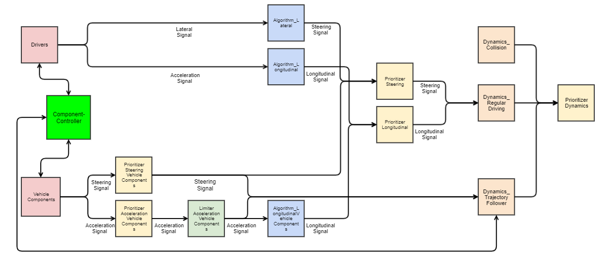
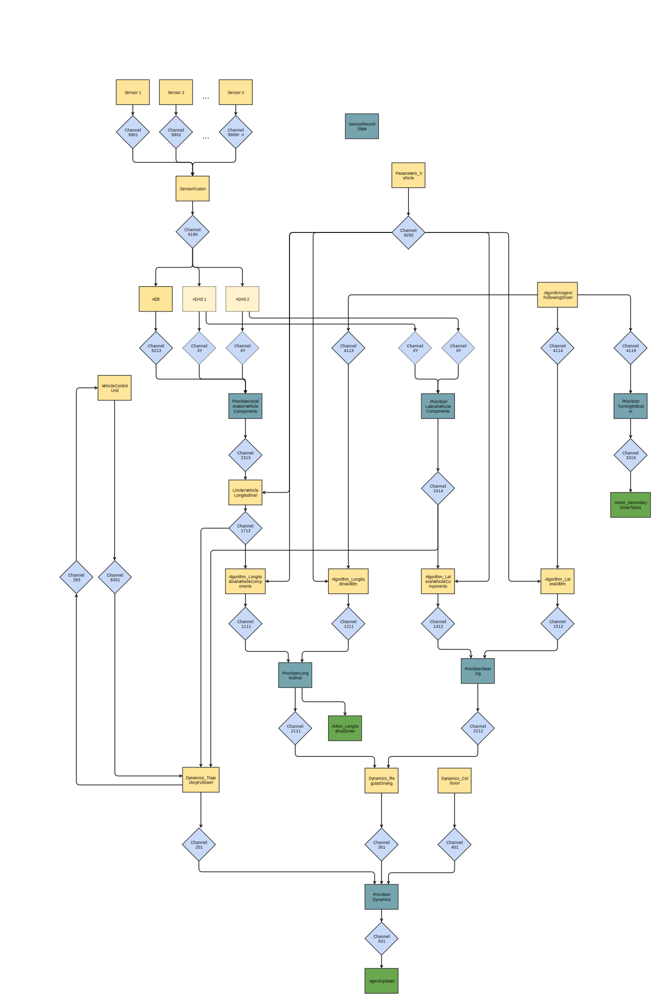
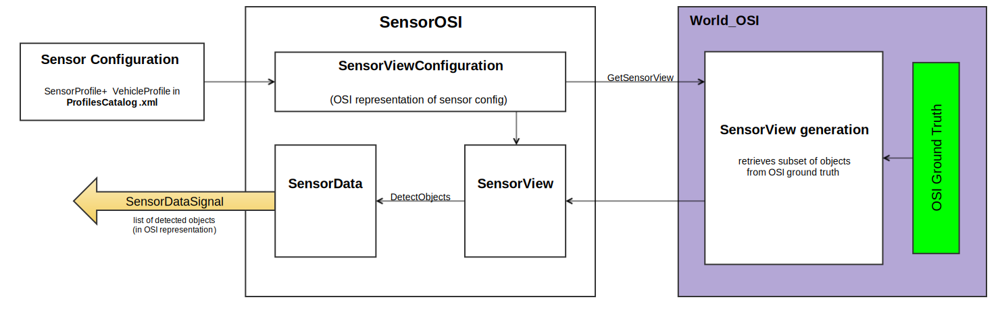
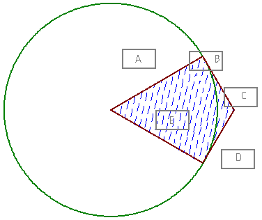
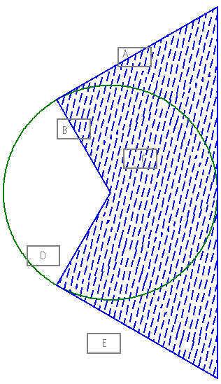
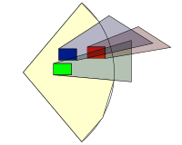
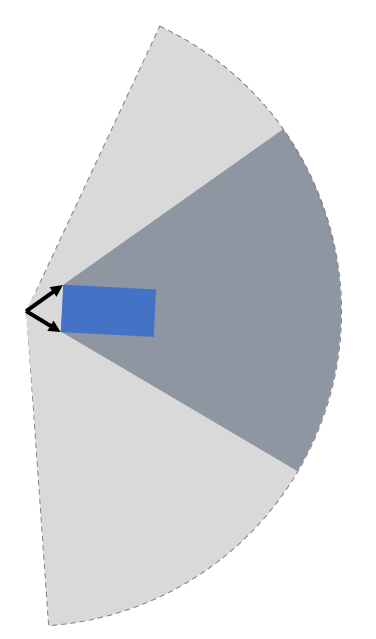
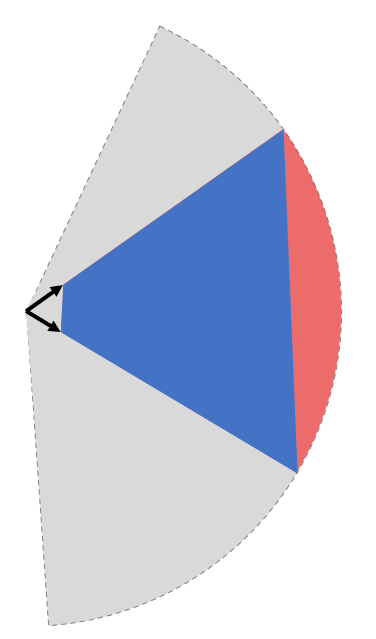
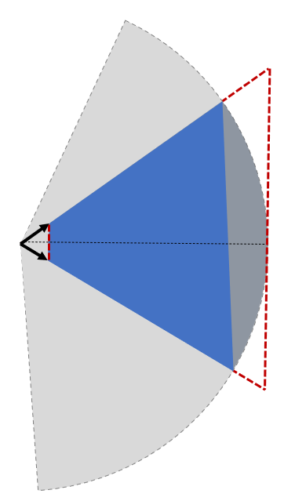
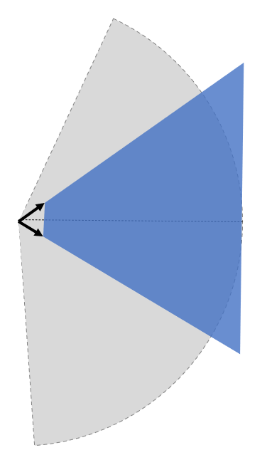

..
  *******************************************************************************
  Copyright (c) 2021 in-tech GmbH

  This program and the accompanying materials are made available under the
  terms of the Eclipse Public License 2.0 which is available at
  http://www.eclipse.org/legal/epl-2.0.

  SPDX-License-Identifier: EPL-2.0
  *******************************************************************************

.. _agentcomponents:

Agent Components
================

An agent in openPASS is composed of multiple modules, which are connected by corresponding signals.
As shown in the next figure, the modules can be roughly divided into the groups drivers, vehicle components, algorithms, dynamic modules, and prioritizers. 
Thereby, modules can consist of several submodules, such as sensor (reading from an interface) and action (writing to an interface).

    Modules for longitudinal and lateral dynamics

By statistic means, based on corresponding probabilities defined in the :ref:`profilescatalog`, each individual agent is composed from a superset of all possible (valid) combinations, which is defined by the :ref:`systemconfigblueprint`.
This config defines all available framework modules and agent modules and connects them by corresponding channels, which in turn have a specific signal type.

The next figure gives an exhaustive overview over the current superset:

.. _component_channel_communication:

    Components and channel communication
    
:download:`./images/ComponentsChannelCommunicationDiagram.svg`

Modules that can be parametrized by the user are explained in the :ref:`Simulation User Guide <simuserguide_components>`.
Therefor the following section only contains the components not listed in the user guide.

Action_LongitudinalDriver
-------------------------

Updates the agents pedal positions and gear.
The input for this module is prepared by the AlgorithmLongitudinal Module.

Action_SecondaryDriver
-----------------------

Updates the agents braking light, indicator, horn and all light switches (headlight, high beam, flasher).
The input for this module is prepared by the driver module.

AgentUpdater
------------

The AgentUpdater executes all Set-Methods of the agent dynamics after the DynamicsPrioritizer. This includes position, velocity, acceleration and rotation.

Algorithm_Lateral
-----------------

This module converts the lateral input of the driver module into a steering wheel angle.

Algorithm_Longitudinal
----------------------

This module converts the acceleration input of the driver module into pedal positions and gear.

Dynamics_Collision
------------------

If the number of collision partners of the agent is bigger than in the previous time step, the DynamicsCollision module calculates the collision. 
Currently the collision is implemented fully inelastic, i.e. all agents will have the same velocity after the collision, while the momentum is conserved. 
After the collision the agents slow down with a fixed deceleration until fully stopped.

Dynamics_RegularDriving
------------------------

The module takes care that the motion of the agent fit to the physical limitations, such as friction or maximum possible acceleration based on the current gear.
This module uses both the world friction and the vehicle model parameter friction.
Thereby it calculates the dynamics of the agents in every time step.
The currently covered  dynamics are *Acceleration*, *Velocity*, and consequently *Position*, *Yaw angle* and *Yaw rate*.
The input for this module is the steering wheel angle and the new acceleration of the vehicle.

LimiterAccelerationVehicleComponents
-------------------------------------

This module limits the AccelerationSignal from the PrioritizerAccelerationVehicleComponents to the constraints given by the vehicle. The DynamicsTrajectoryFollower can then use this signal to calculate a trajectory.

The limit is calculated by :math:`a_{\text{lim}} = \frac {F_{\text{wheel}} - F_{\text{roll}} - F_{\text{air}}} {m_{\text{veh}}}`, where the symbols meanings are:

======================== ================================================
Symbol                   Description                                     
======================== ================================================
:math:`a_{\text{lim}}`   Resulting acceleration limit [m/s²] 
:math:`F_{\text{wheel}}` Force at wheel (provided by drivetrain) [N]    
:math:`F_{\text{roll}}`  Force resulting from rolling resistance [N]    
:math:`F_{\text{air}}`   Force resulting from air drag [N]              
:math:`m_{\text{veh}}`   Mass of the vehicle [kg]                       
======================== ================================================

The components are calculated as follows:

**Driving force**

:math:`F_{\text{wheel}} = \frac {T_{\text{engine}} \cdot r_{\text{axle}}} {r_{\text{wheel}}}`

========================= ============================================================================================
Symbol                    Description                                                                                 
========================= ============================================================================================
:math:`T_{\text{engine}}` Resulting torque from drivetrain at current velocity (assuming best gearing selected) [Nm] 
:math:`r_{\text{axle}}`   Axle transmission ratio [1]                                                                
:math:`r_{\text{wheel}}`  Static radius of the wheels [m]                                                            
========================= ============================================================================================

The engine torque :math:`T_{\text{engine}}` is calculated by a simple model, where the torque scales proportional with the current engine speed between 1350 and 5000 rpm, up to maximum engine torque.
From minimum engine speed up to 1350 rpm the torque scales proportional with the engine speed up to half the maximum torque.
From 5000 rpm up to maximum engine speed, the torque scales with 5000 / maxEngineSpeed, up to maximum torque.

**Rolling resistance**

:math:`F_{\text{roll}} = m_{\text{veh}} \cdot c_{\text{fric}} \cdot g`

========================= ============================================================================================
Symbol                    Description                                        
========================= ============================================================================================
:math:`m_{\text{veh}}`    Mass of the vehicle [kg]                          
:math:`c_{\text{fric}}`   Rolling friction coefficient (constant 0.015) [1] 
========================= ============================================================================================

**Air drag**

:math:`F_{\text{air}} = \frac {\rho_{\text{air}}} {2} \cdot A_{\text{front}} \cdot c_w \cdot v^2`

========================= ============================================================================================
Symbol                    Description                                 
========================= ============================================================================================
:math:`\rho_{\text{air}}` Density of air [kg/m³]         
:math:`A_{\text{front}}`  Vehicle front surface area [m²] 
:math:`c_w`               Drag coefficient [1]                       
:math:`v`                 Vehicle's current velocity [m/s]           
========================= ============================================================================================

OpenScenarioActions
-------------------

As defined by openSCENARIO, OpenScenarioActions is the relaying module for:

- Trajectory-actions
- LaneChange-actions 
- UserDefined-actions.
  
If a

- TrajectoryManipulator
- LaneChangeManipulator

or a user defined manipulator
  
raises such an event for the specified agent, the module forwards it as signal to all interested module of the corresponding agent. The modules can than react on the signals content without time delay.

Parameters_Vehicle
-------------------

The ParametersVehicle module forwards the VehicleModelParameters to all other modules that need them via the ParametersVehicleSignal

Sensor_Driver
--------------

The SensorDriver performs queries on the AgentInterface to gather information about the own agent and its surroundings. These are forwarded to the driver modules and the Algorithm modules, which use them for their calculations.

Sensor_OSI
-----------

This module is a representation of various sensors and uses OSI for its input and output.
Currently it only has one type of sensor (SensorGeometric2D) which detects all objects in sector with specified range and opening angle.
The input of the sensor is a OSI SensorView generated by the OSI World and its output is a OSI SensorData structure.

For generation of the SensorView, a SensorViewConfiguration has to be provided by the sensor to the OSI World. See image for a visualization of the
dataflow.

    OSI SensorView dataflow

From OSI development perspective, the OSI World would have to send back a SensorViewConfiguration to the sensor, with the contents describing the
actual configuration of the SensorView (since the World is maybe notable to provide the requested information).
As we have full control over the simulation environment, this back-channel is skipped and SensorView according to the sensor'S SensorView configuration
will always be provided.

To test whether an object is inside our sector we check
1. if it is inside the circle around the sensor with radius the detection range and
2. if it intersects a suitable polygon

Depending on the opening-angle the polygon in 2) has either four (angle < 180°) or five corners (angle >= 180°).

    four-corner kite polygon for angle lower than 180°

======= ================= ================== =========
Object  intersects circle intersects polygon detected
======= ================= ================== =========
A       true              false              false
B       true              true               true
C       false             true               false
D       false             false              false
E       true              true               true
======= ================= ================== =========

    five-corner polygon for angle greater or equal 180° and greater 360°

======= ================= ================== =========
Object  intersects circle intersects polygon detected
======= ================= ================== =========
A       false             true               false
B       true              true               true
C       true              true               true
D       true              false              false
E       false             false              false
======= ================= ================== =========

For convex BBoxes the above will give correct detection results.

Both polygons are constructed from corner-points consisting out of the intersection between the opening-angle boundaries at maximum detection range and their corresponding tangents.

Function
~~~~~~~~

1. Construct the polygon based on the opening-angle
2. Check if detection-field (polygon) intersects with any BBox (object-detection)
3. Calculate the distance between sensor and object
4. if (dist <= range && isIntersecting) -> object is in circular sector (object validation)

Cases
~~~~~

- For angles < 1.0 * pi a four-corner (kite) polygon can be constructed out of two radiuses and two tangents.
- For angles > = 1.0 * pi and < 2.0 * pi a five-corner polygon can be constructed of two radiuses an three tangents.
- For opening-angle of exactly 2.0 * pi the distance information suffices. No polygon is needed.

Visual Obstruction
~~~~~~~~~~~~~~~~~~

Objects in front of others block the sensors line of sight. If an object is large enough it might visually obstruct others.
To check if one or multiple objects in combination "shadow" other objects the EnableVisualObstruction - flag can be set.
Also the minimum required percentage of the visible area of an object to be detected can be specified.
The implemented algorithm uses the concept of shadow-casting.

**Basic**  

    Example of shadow-casting

The sensor can be pictured as a light source.
Every object in the detection field of the sensor will therefore cast a shadow and reduce the overall detection area behind it.
If an object is shadowed too much, it is removed from the list of detected objects.
After all shadows are removed, only the "real" detection field polygon (yellow area) remains.
Objects in green and blue are detected.
The red object is completely covered by shadows and therefore not detected.

**Step by Step**

Shadow casting is calculated as follows (see figure below):
1. Approximate detection field as circular sector (bright area).
2. Calculate the casted shadow of each object inside the detection field.
3. Remove the casted shadow from the detection field.
4. Check for each object if the remaining area is inside the remaining polygon.
5. Removed objects if the relation  `covered object area/total object area` is smaller than a parameterizable threshold.

**Details**

The approximation of the detection range is deliberately calculated along its edge and not by means of a tangential approximation.
The areal error along the edge is regarded as negligible w.r.t to the sizes of objects and commonly used detection ranges.

    Shadow casting detail 1
    
For the calculation of the shadowing polygon, the confining vectors for the object of interest are calculated (see detail 1).

    Shadow casting detail 2
    
Scaling the length of the vectors w.r.t. the detection range would only to reach the boundary and not suffice, as the resulting polygon is too small (red area in detail 2 not covered).

    Shadow casting detail 3

A larger scale factor is necessary, but needs to be calculated dynamically, as a too small factor might not suffice for very close objects and a very large factor could lead to numerical issues.
Hence, the scale is calculated dynamically as depicted in detail 3, by comparing two isosceles triangles, laying in between the two vectors.
This is only an approximation of the true triangles, but an upper bound, which allows faster processing.
The final scale resolves to `detection_radius / projected_height`, where the projected height is taken from shorter vector.

    Shadow casting detail 4
    
As shown in detail 4, the scale is just large enough to include the whole detection range, preventing potential numerical issues.
This only holds as long as the detection range is approximated as described above.

SensorFusionOSI
---------------

The SensorFusionOSI module allows unsorted aggregation of any data provided by sensors. All sampled detected objects can then be broadcasted to connected ADAS.

It collects all SensorDataSignals and merges them into a single SensorDataSignal.

.. _agentcomponents_signalprioritizer:

SignalPrioritizer
-----------------

All channels can only have one source.
If one module can have the same input type from multiple sources a prioritizer module is needed in between.
All sources then get an output channel to the prioritizer module and the prioritizer gets an output to the module, which uses this signal.
If more than an component sends an active signal during the same timestep, the prioritizer forwards only the signal from the input channel with the highest priority.
These priorities are set as parameters in the systemconfigblueprint.xml, where the key corresponds the the id of the input channel and the value is the priority (higher value is prioritized).
In the following example the channel with id 102 has the highest priority (3) and the channel with id 100 has the lowest priority (1).

.. code-block:: xml

   <component>
     <id>PrioritizerName</id>
     <schedule>
       <priority>150</priority>
       <offset>0</offset>
       <cycle>100</cycle>
       <response>0</response>
     </schedule>
     <library>SignalPrioritizer</library>
     <parameters>
       <parameter>
         <id>100</id>
         <type>int</type>
         <unit/>
         <value>1</value>
       </parameter>
       <parameter>
         <id>101</id>
         <type>int</type>
         <unit/>
         <value>2</value>
       </parameter>
       <parameter>
         <id>102</id>
         <type>int</type>
         <unit/>
         <value>3</value>
       </parameter>
     </parameters>
   </component>

One prioritizer module can only handle signals of the same type and the signal class must be derived from ComponentStateSignal.
If there is no signal in one time step, then the signal of the previous time step is hold.

**Existing prioritizer modules**

* PrioritizerAccelerationVehicleComponents
* PrioritizerSteeringVehicleComponents
* PrioritizerTurningIndicator
* PrioritizerLongitudinal
* PrioritizerSteering
* PrioritizerDynamics

ComponentController
-------------------

Overview
~~~~~~~~~

The ComponentController (CC) is used to configure and handle dependencies between other vehicle components.

Example use cases could be:

- Cruise control:

  - driver requesting higher acceleration than cruise control overrides the latter
  - driver braking deactivates cruise control
  
- Lane keeping assistant:

  - cannot be activated by driver, if emergency braking is currently active
  - stays active, when emergency braking occurs (i. e. by other ADAS)

The responsibilies of the CC are:

- Handling of all dependencies between *VehicleComponents* in case a component wants to activate
- Make information about driver, *TrajectoryFollower* and other *VehicleComponents* available to each other
- Determine the highest allowed activation state of a component and notify the affected component about this state

To achieve this tasks, each component is assigned a maximum allowed state in each time step. This state is of type ComponentState,
which defines *Disabled*, *Armed* or *Active* as allowed states.
Drivers can be in a state of either *Active* or *Passive*.

State handling inside Vehicle Component
~~~~~~~~~~~~~~~~~~~~~~~~~~~~~~~~~~~~~~~

Within a vehicle component, the information flow should be implemented as follows:

1. The vehicle component retrieves the information of other components and the current maximum allowed state from the CC.
   Other components include drivers, trajectory followers and all other vehicle components connected to the CC.
2. Based on that information the vehicle component determines its current desired state.
3. The desired state is sent to the CC.

The CC handles all the dependencies between different components and determines the maximum allowed state for each component based
on the configuration of the CC.

Used signals
~~~~~~~~~~~~~

The CC communicates with the controlled components via framework signals.

Inputs to the ComponentController:

.. table::
   :class: tight-table

   ================== ===================================================== =============================
   Source             Contents                                              Signal                      
   ================== ===================================================== =============================
   TrajectoryFollower Current state                                         ComponentStateSignal        
   Driver             Current state, pedal activity                         DriverStateSignal           
   VehicleComponent   Current state, desired state, generic ADAS parameters VehicleCompToCompCtrlSignal 
   ================== ===================================================== =============================

Output to other components:

.. table::
   :class: tight-table

   ================== ========================================================================== =============================
   Destination        Contents                                                                   Signal                      
   ================== ========================================================================== =============================
   TrajectoryFollower Current max. reachable state                                               ComponentStateSignal        
   Driver             List of all ADAS with names, stati and types                               AdasStateSignal             
   VehicleComponent   Current max. reachable state, list of all ADAS with names, stati and types CompCtrlToVehicleCompSignal 
   ================== ========================================================================== =============================
