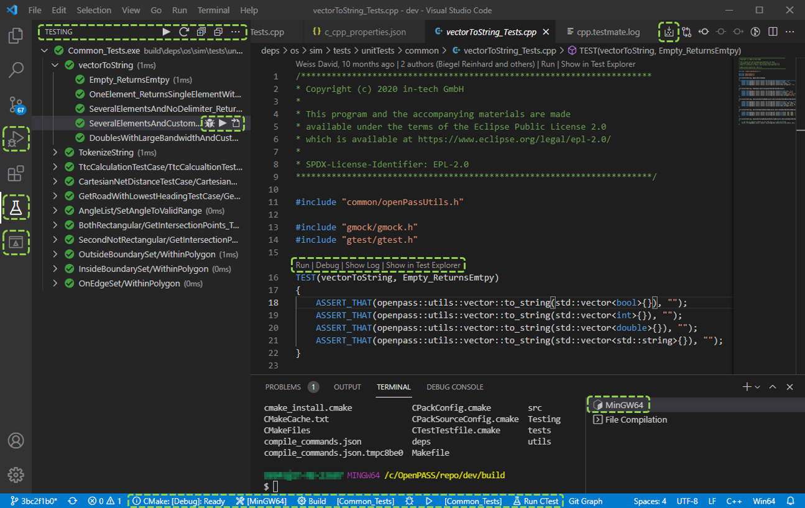

..
  *******************************************************************************
  Copyright (c) 2021 in-tech GmbH

  This program and the accompanying materials are made available under the
  terms of the Eclipse Public License 2.0 which is available at
  http://www.eclipse.org/legal/epl-2.0.

  SPDX-License-Identifier: EPL-2.0
  *******************************************************************************

.. |win_only| image:: /_static/win_only.png

.. _vscode:

Working with Visual Studio Code
===============================

This section describes the basic setup for Visual Studio Code.

   Correctly configured Visual Studio Code showing -- among other things -- **left**, debugging, testmate, and cmake pane selectors, and at the **bottom**, build type, kit, current target, and CTest runner.

Assumptions
-----------

- For brevity, non-standard libraries are expected to be in the folder ``./deps/thirdParty``.
- |win_only| **MSYS2/MinGW 64 Bit** is used.

Installation
------------

1. Install Visual Studio Code (https://code.visualstudio.com)

2. Install Extensions

.. table::

   ======================================================================================================== =======================================================
   Name                                                                                                     Purpose
   ======================================================================================================== =======================================================
   `C/C++ <https://marketplace.visualstudio.com/items?itemName=ms-vscode.cpptools>`_                        Support for C/C++, including IntelliSense and debugging
   `CMake Tools <https://vector-of-bool.github.io/docs/vscode-cmake-tools>`_                                Extended CMake support
   `C++ Testmate <https://marketplace.visualstudio.com/items?itemName=matepek.vscode-catch2-test-adapter>`_ Run and debug GoogleTest
   `MSYS2/Cygwin/MinGW/Clang support <https://marketplace.visualstudio.com/items?itemName=fougas.msys2>`_   |win_only| MSYS2/MinGW configuration adapter
   ======================================================================================================== =======================================================

3. Open the repository as folder, e.g. by calling ``code simopenpass`` after checking out.
   Say yes, when CMake Tools ask to configure the project.
   This creates a ``build`` folder, **but fails** (well, we need to config some stages).

Configuration
-------------

|win_only| MSYS2 Path
+++++++++++++++++++++

Normally, runtime dependencies (DLLs) are not copied into the executables folder within the build process.
This means, that programs cannot be executed natively from Windows shells or the explorer.
It is therefore highly recommended, to set the environmental variable ``MSYSTEM=MINGW64`` and ``CHERE_INVOKING=1``. 
The setting of ``MSYSTEM`` will cause the environment to be set up correctly for MinGW64.
Windows will then look for DLLs within the msys64 folders, allowing native execution.
``CHERE_INVOKING`` makes sure the shell stays in the current working directory.
As investigated recently, the ``C:\msys64\usr\bin``must also be added to the ``PATH`` environment variable in order to resolve dependencies to ``cygpath.exe``. 

Either set environment variable through the ``Windows PowerShell``

.. code:: PowerShell

   # check if set
   echo ${env:path}
   echo ${env:MSYSTEM}
   echo ${env:CHERE_INVOKING}

   # if not
   setx path "%PATH%;C:\msys64\usr\bin"
   setx MSYSTEM "MINGW64"
   setx CHERE_INVOKING "1"

or 

1. Open the start search
2. Type in “env” and choose “Edit the system environment variables”
3. Choose “Environment Variables…” 
4. Set the environment variables:
   
   i. MSYSTEM=MINGW64
   ii. CHERE_INVOKING=1
   iii. Add ``C:\msys64\usr\bin`` to PATH

Visual Studio Code needs to be reloaded/restarted after the path update.

.. note:: 

   An optimal solution would be to set the system environment variables in VSCode under ``settings.json``. This is currently not possible. Please contact us if you find a better solution.

IDEs, as Qt Creator, might set this variable base on the current build type on their own.

Build Kit
+++++++++

.. tabs::

   .. tab:: Windows

      **Add and select MSYS2/MinGW64 Build Kit:**

      1. Execute ``Ctrk+Shift+P``: ``CMake: Edit User-Local CMake Kits``

      2. Insert/Update:

         .. literalinclude:: _static/vscode/config/win/cmake-tools-kits.json
            :caption: cmake-tools-kits.json
            :language: javascript
            :linenos:

         :download:`Download <_static/vscode/config/win/cmake-tools-kits.json>`

      3. ``Ctrk+Shift+P``: ``CMake: Select a Kit`` = ``MinGW64``

   .. tab:: Linux

      **Select System Build Kit:**

      ``Ctrk+Shift+P``: ``CMake: Select a Kit`` = ``GCC 10.2.0``

      See also :ref:`prerequisites`.

User Settings
+++++++++++++

1. Execute ``Ctrk+Shift+P``: ``Preferences Open Workspace Settings (JSON)``

2. Insert/Update:

   .. tabs::

      .. tab:: Windows

         .. literalinclude:: _static/vscode/config/win/settings.json
            :caption: settings.json
            :language: javascript
            :linenos:

         :download:`Download <_static/vscode/config/win/settings.json>`

      .. tab:: Linux

         .. literalinclude:: _static/vscode/config/linux/settings.json
            :caption: settings.json
            :language: javascript
            :linenos:

         :download:`Download <_static/vscode/config/linux/settings.json>`

C++ and IntelliSense
++++++++++++++++++++

1. Execute ``Ctrk+Shift+P``: ``C/C++: Edit Configurations (JSON)``

2. .. literalinclude:: _static/vscode/config/c_cpp_properties.json
     :caption: c_cpp_properties.json
     :language: javascript
     :linenos:

   :download:`Download <_static/vscode/config/c_cpp_properties.json>`

Configure the Build
+++++++++++++++++++

Execute ``Ctrk+Shift+P``: ``CMake: Configure``

CMake should now be able to configure the project.
If not, cmake should give you at least a hint, what's missing (normally external libraries).  
Read :ref:`cmake` or :ref:`prerequisites` for more information.

.. admonition:: CMake

 Some changes such as changing the build type (Debug/Release) will cause CMake to updates the configuration automatically.
 Other changes won't trigger an update, such as changing the paths to libraries (`CMAKE_PREFIX_PATH`), the cmake cache needs to be cleared before reconfiguration:  
 ``Ctrk+Shift+P`` > ``CMake: Delete Cache and Reconfigure``

Debug Targets
+++++++++++++

CMake Tools and C++ Testmate automatically use custom launch configurations, if available.
When using the debugging functionality, the according executable will be executed from where they are built (per default inside the ``build`` folder).  

- This is acceptable for unit test, which do not require openPASS specific libraries.  
  The corresponding config is ``CMake Target``.

- For the core, located at ``./build/sim/src/core/opSimulation/opSimulation``, this does not work, as no libraries and no configurations are available.
  As a solution, a second debug target ``opsimulation`` points at the installed executable instead.

  .. warning:: Don't forget to run the target ``install`` before debugging .

1. Got to "Run and Debug" (``Ctrl+Shift+D``) and *create a launch.json file*.

2. Insert/Update:

.. tabs::

   .. tab:: Windows

      .. literalinclude:: _static/vscode/config/win/launch.json
         :caption: launch.json
         :language: javascript
         :linenos:

      :download:`Download <_static/vscode/config/win/launch.json>`

   .. tab:: Linux

      .. literalinclude:: _static/vscode/config/linux/launch.json
         :caption: launch.json
         :language: javascript
         :linenos:

      :download:`Download <_static/vscode/config/linux/launch.json>`

.. note::

   IntelliSense uses the ``compile_commands.json`` of generated through ``CMAKE_EXPORT_COMPILE_COMMANDS=ON`` (see ``settings.json``).
   This is necessary for proper resolution of the include files.

Troubleshooting
---------------

|win_only| **Program does not start**

The most effective way to debug startup issues is by means of the `Process Monitor <https://docs.microsoft.com/en-us/sysinternals/downloads/procmon>`_.

But normally, its a missing DLL. When executing the program via command line or explorer a message box should prompt which DLLs are missing.
A simple solution is to copy the according DLLs into the folder of the executable.
Another solution is to make the path available by extending the ``PATH`` environment variable.
Potential sources for missing DLLs are ``C:\msys64\mingw64\bin``, ``C:\msys64\mingw64\x86_64-w64-mingw32\lib``, and the ``build`` folder itself.

**Tests are not listed**

For test discovery, C++ Testmate needs to know the location of all additional dependencies.
This information is retrieved from the current debug configuration.

#. Testmate discovers tests only after they are built.
   It pays to ``Run CTest`` to build all test targets.
   After this, you should see all tests in the testing pane on the left.

#. Still not listed? Set ``testMate.cpp.log.logfile`` in ``settings.json`` and check log.

   #. Test executable not mentioned at all:
      Executable name might not fit (check glob pattern in ``testMate.cpp.test.executables``).
   #. Log reports *Error: Not a supported test executable*: a library/DLL might be missing.
