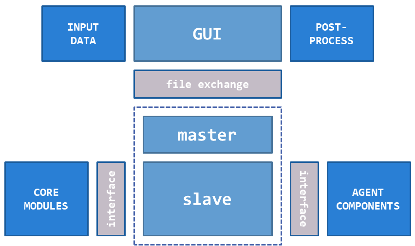
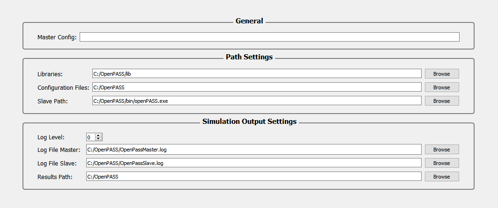
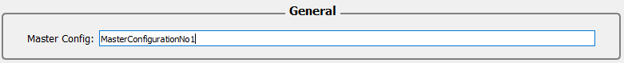
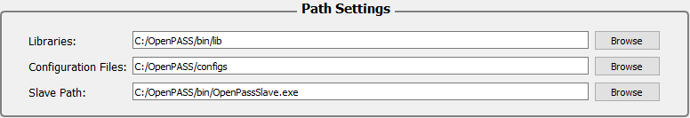
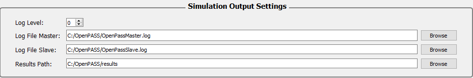

..
  ************************************************************
  Copyright (c) 2021 ITK-Engineering GmbH

  This program and the accompanying materials are made
  available under the terms of the Eclipse Public License 2.0
  which is available at https://www.eclipse.org/legal/epl-2.0/

  SPDX-License-Identifier: EPL-2.0
  ************************************************************

.. _user_guide_overview:

Overview
========

Getting Started
---------------

This tutorial is a guide on how to configure a simulation. 

   * Scenario Simulation: by changing the configuration files.
   * PCM simulation: by using the openPASS graphical user interface (GUI). 

In particular, it is presented how to go through the required steps until a simulation can be run successfully.  
To enhance the guiding, there are going to be examples in every section. 
It is important to mention that openPASS is still in progress and e. g. some plugins and options have not been fully implemented yet.

Interaction GUI and Framework
^^^^^^^^^^^^^^^^^^^^^^^^^^^^^

The GUI sits on top of the simulation framework. It produces configuration files for the framework based on the User Input.
With these files, the GUI can trigger the simulation to start und produce results in form of different files. 
These files can then be read evaluated by the GUI.

Overview of the GUI Plugins
^^^^^^^^^^^^^^^^^^^^^^^^^^^

   * Simulation Plugins

      * :ref:`project`
      * :ref:`system_editor`
      * :ref:`pcm_sim`

   * Result Preview Plugins

      * :ref:`pcm_eval`
      * :ref:`timeplot`
      * :ref:`statistics`

   * Work in Progress (only listed)

      * agentConfiguration
      * trafficSimulation

Workflow
^^^^^^^^

A typical workflow can be:

   1. Create a system in the system editor
   2. Configure a simulation and start it using a Simulation plugin
   3. Evaluate the results using a Result Preview plugin
   4. Use the generated results and make use of them by starting from point 2 again

Simulation Start from GUI
-------------------------

To simply start a simulation from the gui, the :ref:`project` Plugin can be used

.. _project:

Project
^^^^^^^

Before the simulation adjustments begin, the user is obligated to load or create a “Master Configuration” (masterConfig). 
A Master Configuration in openPASS can be understood as a project. 
It is a XML-File which get inscribed the path settings and simulation settings after you click **SAVE**.

General
"""""""

In this segment you are able to name the Master Configuration. In our example it is called *MasterConfigurationNo1*.

Path Settings
"""""""""""""

The next step is path settings. 
These will change depending on where your openPASS.exe is located. 
In the screen shot above the openPASS.exe is located at ``C:/OpenPASS``. 
For easier use of this tutorial it is recommended to save the Demo Folder in ``C:/`` and name it *OpenPASS*.
On to the settings. 
As you can see three paths need to be set. 
The library comes with openPASS. 
There are plans to remove the option for the user to set the library path, but at this moment there is still the option to change it, although this is not recommended.
The Slave Path references the OpenPassSlave.exe, the file to execute the slave. 
If you are using the provided Demo, there is no need for you to change it. 
The only path you need to set is the path of the Configuration Files. 
In the Demo it will be located at [directory of openPASS.exe]/configs, so in this case it would be C:/OpenPASS/configs.

Simulation Output Settings
""""""""""""""""""""""""""

Next step is the Simulation Output Settings. There are three output files. First is the log file of the master. 
However, when simulation jobs are started by the GUI, the openPASS master is not executed and, hence, the master log will not contain any log entries. 
Second is the log file created by the slave. In this log file you will find error messages, actions of the slave etc. depending on the log level. 
The Log level lets you choose which type of messages are logged. “0” means that only errors are logged, 
whereas the highest log level of “5” leads to the most detailed description of which steps are executed by the slave. 
The results path specifies the folder in which the results of a successful simulation will be saved. 

.. note:: 

   It is recommended to create a new folder in C:/OpenPASS called “results” and set it as the results path as in the picture above.
