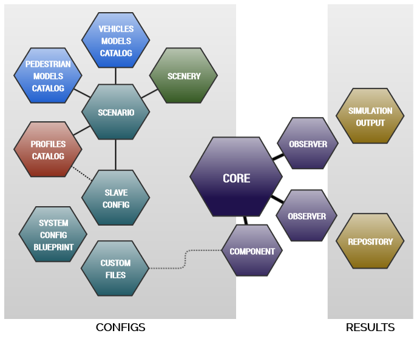

..
  ************************************************************
  Copyright (c) 2021 in-tech GmbH

  This program and the accompanying materials are made
  available under the terms of the Eclipse Public License 2.0
  which is available at https://www.eclipse.org/legal/epl-2.0/

  SPDX-License-Identifier: EPL-2.0
  ************************************************************

.. _sim_user_guide:

Scenario Simulation 
===================

.. admonition:: Before we start...

   The official Working Group website of |op_oss| (https://openpass.eclipse.org/) offers a lot of information, well suited for beginners.

|Op| is a tool for executing a traffic based Monte-Carlo simulation and provides capabilities for the following two levels of variation:

#. **Experiment:** Topmost, an experiment defines the domains of possible inputs, which shall be compared, such as *"traffic at high volume"* with *"traffic at low volume"*.
   In this sense, a parameter variation is done at a very coarse level, resulting in two sets of inputs.
   Note that this level is covered by the GUI (see :ref:`pcm_simulation_guide`).

#. **Invocation:** When an input-set is available, |op| invokes a defined number of runs, resulting in a probabilistic sampling of the given state under parameterizable conditions.
   For example, in the aforementioned situation *"traffic at high volume"*, it would generate participants at *"lower speeds"* and *"smaller gaps"*.
   Thereby parameterizable means, that the user has the freedom to define probabilities defining *"lower speed"* and *"smaller gaps"*.
   In each invocation, |op| samples from these probabilities to generate a possible traffic situation under the given parameter variation.

This guide primarily covers the aspect of the second tier, describing the parts an input-set and the expected output.

Intended Audience
-----------------

This manual serves as an entry point for users who have an operational simulator at hand (see :ref:`sim_install_guide`) and want to carry out (first) experiments at the invocation level (*GUI-less mode*).
In this sense, it primarily tackles how input-sets are composed, their interdependencies and, finally, the generated outputs.

This image shows the *GUI-less* workflow, starting with the input-set, bundled together in a folder typically named ``configs``.
The ``core``, executed manually by the experimenter, processes these configs and generates an (configurable) output-set typically placed in a folder named ``results``.
Thereby, the **Simulation Output** is again a set of files.

Primer
------

In the following the input and output sets are described with respect to the intended audience.
For detailed information please refer to the "in-depth" documentation of the individual files.

Inputs
~~~~~~

The input is focused around the following files, with decreasing importance for the current audience. 

- **Scenario**
  
  This file describes the overall situation in terms of the **ASAM OpenSCENARIO 1.0** standard.
  This includes placement of cars, the story (what happens when), how long the simulation will run.
  
  On top it contains links to additionally needed files, where the following might need modification with respect to the current audience:

  - **Scenery** (``*.xosc``)
  
    The **scenery** file, which follows the **ASAM OpenDRIVE 1.6** standard, describes the world in which the experiment runs, such as a highway, or a parking lot.
    As such, it contains the description of the road network and any static object, such as traffic signs or obstacles.

  - **ProfilesCatalog** (``*.xml``)

   This catalog describes the profiles of moving participants and are the probabilistic heart of the simulation.
   A profile could be a **MiddleClassCar**, and describes which components could be available with what probability.
   Such components could be ADAS's or sensors and as such, their parametrization is also found here.

   .. note:: As **OpenSCENARIO** does not support probabilities (yet), this file is not conform to the standard.

  - **VehiclesCatalog** and **PedestriansCatalog**: (``*.xosc``)

    These catalogs, also based on **OpenSCENARIO**, describes the physical parameters of available vehicles or pedestrians, respectively.

    .. note:: 
    
       Historically, the referenced files have carry an additional *Model* in the filename: ``VehicleModelsCatalog.xosc`` and ``PedestrianModelsCatalog.xosc``

- **SlaveConfig** (``slaveConfig.xml``)

  This is the entry point for the simulation, containing the setup of the core, such as active observers, reference to the scenario, the initial random seed, and the number or invocations.

  .. note::
     
     This file is normally of limited interest.
     Yet, some variations, such as *environmental conditions* are historically placed in here and not in the scenario description. 
     It is therefore recommended to study the contents of this file.

- **SystemConfigBlueprint** (``systemConfigBlueprint.xml``)

  This file is contains a superset of all possible *components* and their valid connections. 
  Such components can be lateral and longitudinal controllers, assistance systems, prioritizers, driver models, and so on.
  Depending on the configured profiles and their probabilities, the core picks a subset of components to create one complete *system*.

  .. warning:: This file should not be changed without the proper (developer) expertise.

  .. note:: 
  
     Instead of using an overall blueprint, concrete (static) systems can be specified using the same format. 
     These files are simply referred to as ``SystemConfig`` files.

Some components need their own input files (e.g. a configuration).
It is convention to put these files also into the ``configs`` folder, which is internally provided as path to the components.
This helps to keep experiments separated.

Outputs
~~~~~~~

Outputs are generated by individual observers, configured by the **SlaveConfig**, and collected within the folder `results`.
This section describes the output files by the :ref:`observation_log`, as configured by the provided example configurations.

Please refer to the documentation of the individual observers and files for more details.

- **Simulation Output** (``simulationOutput.xml``)

  This file acts as central entry point for further evaluation, such as the visualization.
  It contains central information about all executed invocations within an experiment, such as the executed scenario and the run results, which can be seen as current values from the random sampling of the given probabilities.
  As such, each run result contains, a list of participating moving entities (also referred to as agents), events related to the entities, such as collisions or activation of ADAS's, and a reference to the *cyclics file*.

  .. note:: This file **does not** contain information about the actual position of agents.

- **Cyclic Output** (``Cyclics_Run_###.csv``)

  This file contains the ground truth information for each agent at each time step.
  For each invocation, a new file is generated (starting with ``Cyclics_Run_000.csv`` and referenced in the according run results in the ``simulationOutput.xml``.

  .. note:: This file **does not** contain information about the interaction between agents.

.. note:: 

   The core generates a file called ``LogSlave.txt`` at the execution path, which logs errors and warnings.
   If the simulation behaves strange or did not produce any output, check this file.

Component View
~~~~~~~~~~~~~~

|Op| is divided into components, which can be roughly divided into **core components** and **model components**.
The most interesting core components are the individual **spawners**, which are responsible for populating the world in a realistic fashion.
Model components are again roughly divided into **drivers** and **vehicle components** and represent how an individual participant is composed.

.. note::
   
   There are several additional components acting in the background, making sure things work as they should.
   As a guideline, components parameterized through the **ProfilesCatalog** are scope of this guide, others not.

.. todo:: Move Inputs, Outputs, and Components to their own master section

.. _inputs_in_depth:

Inputs in Depth
---------------

As described in the primer above, not all inputs might be of interest for the targeted audience.
Yet, for completeness, all potential input files shall be described here in detail.

.. toctree::
   :glob:
   :maxdepth: 1

   sim_user_guide/input/*

Outputs in Depth
----------------

As described in the primer above, simulation outputs are generated by the corresponding observers.
In the following, all potential outputs are described, grouped by the corresponding observers.

.. toctree::
   :glob:
   :maxdepth: 3

   sim_user_guide/output/*
   
.. _simuserguide_components:

Components in Depth
-------------------

In the following, all available components are described.

.. toctree::
   :glob:
   :maxdepth: 3

   sim_user_guide/components/*

Use Cases Examples
------------------

.. toctree::
   :glob:
   :maxdepth: 1

   sim_user_guide/examples/*

