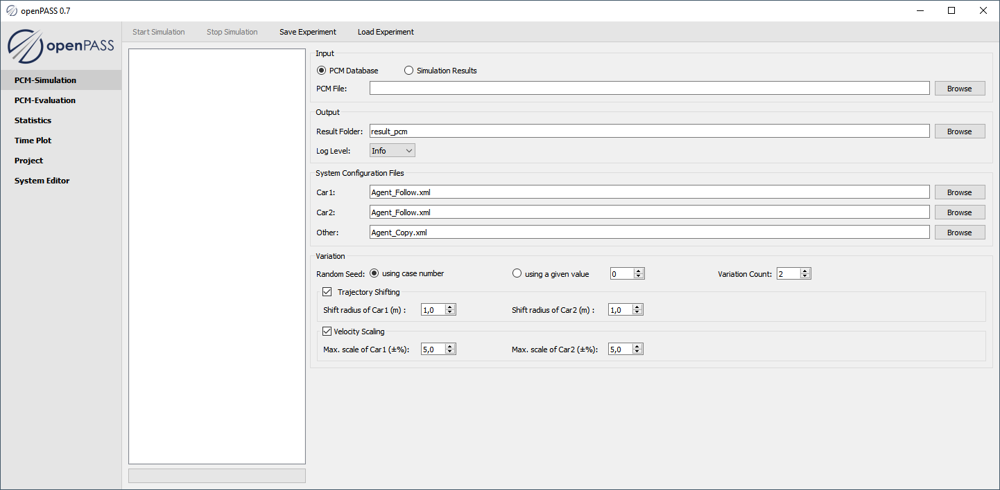

..
  ************************************************************
  Copyright (c) 2021 ITK Engineering GmbH

  This program and the accompanying materials are made
  available under the terms of the Eclipse Public License 2.0
  which is available at https://www.eclipse.org/legal/epl-2.0/

  SPDX-License-Identifier: EPL-2.0
  ************************************************************

.. _pcm_simulation_guide:

PCM Simulation
==============

.. toctree::
   :glob:
   :maxdepth: 1

   gui_user_guide/pcm_sim
   gui_user_guide/pcm_eval
   gui_user_guide/system_editor

