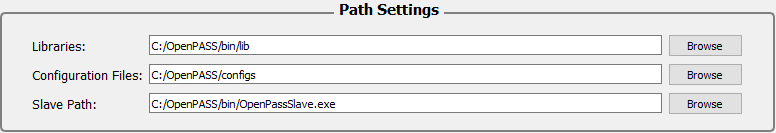

..
  ************************************************************
  Copyright (c) 2021 ITK-Engineering GmbH
  Copyright (c) 2021 Bayerische Motoren Werke Aktiengesellschaft (BMW AG)

  This program and the accompanying materials are made
  available under the terms of the Eclipse Public License 2.0
  which is available at https://www.eclipse.org/legal/epl-2.0/

  SPDX-License-Identifier: EPL-2.0
  ************************************************************
  

.. _project:

Project
=======

The Project Plugin can be used to simply start a simulation from the gui.

.. image:: _static/images/plugin/project/overview.png

Before the simulation adjustments begin, the user is obligated to load or create a “Simulation Manager Configuration” (`opSimulationManager.xml`). 
Such a configuration in openPASS can be understood as a project. 
It is a XML-File which get inscribed the path settings and simulation settings after you click **SAVE**.

General
-------

.. image:: _static/images/plugin/project/general.png

In this segment you are able to name the Simulation Manager Configuration.

Path Settings
-------------

The next step is path settings. 
These will change depending on where your openPASS.exe is located. 
In the screen shot above the openPASS.exe is located at ``C:/OpenPASS``. 
For easier use of this tutorial it is recommended to save the Demo Folder in ``C:/`` and name it *OpenPASS*.
On to the settings. 
As you can see three paths need to be set. 
The library comes with openPASS. 
There are plans to remove the option for the user to set the library path, but at this moment there is still the option to change it, although this is not recommended.
The Simulation Path references the opSimulation.exe, the file to execute the simulation.
If you are using the provided Demo, there is no need for you to change it. 
The only path you need to set is the path of the Configuration Files. 
In the Demo it will be located at ``[directory of openPASS.exe]/configs``, so in this case it would be ``C:/OpenPASS/configs``.

Simulation Output Settings
--------------------------

.. image:: _static/images/plugin/project/simOutputSettings.png

Next step is the Simulation Output Settings. There are three output files. First is the log file of the simulation manager. 
However, when simulation jobs are started by the GUI, the openPASS simulation manager is not executed and, hence, the log will not contain any entries. 
Second is the log file created by the simulation. In this log file you will find error messages, actions of the simulation etc. depending on the log level.
The Log level lets you choose which type of messages are logged. “0” means that only errors are logged, 
whereas the highest log level of “5” leads to the most detailed description of which steps are executed by the simulation.
The results path specifies the folder in which the results of a successful simulation will be saved. 

.. note:: 

   It is recommended to create a new folder in C:/OpenPASS called “results” and set it as the results path as in the picture above.
