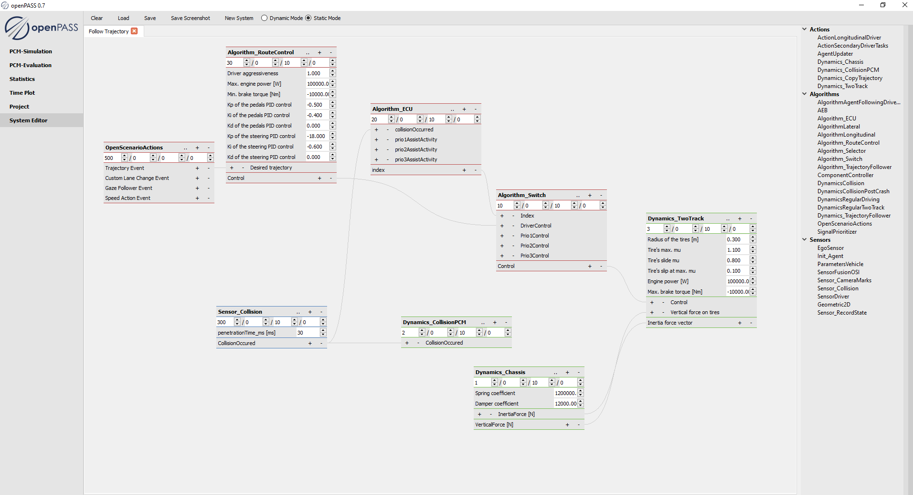

..
  *******************************************************************************
  Copyright (c) 2021 ITK Engineering GmbH

  This program and the accompanying materials are made available under the
  terms of the Eclipse Public License 2.0 which is available at
  http://www.eclipse.org/legal/epl-2.0.

  SPDX-License-Identifier: EPL-2.0
  *******************************************************************************

.. _system_editor:

System Editor
=============

The System Editor helps building the system configuration (systemConfig) in the GUI. 
This file is also a XML-file and specifies the components of an agent and systems used, in this case advanced driver assistance systems. 

The editing of the System Configuration has two modes: the static and dynamic mode.

The **static mode** requires the user to build a complete system which includes sensors, algorithms and actions. 
As the actions directly manipulate the simulated vehicle’s parameters, which are the same no matter the system (i.e. gas pedal position, braking pedal position, steering wheel angle), there is no need to code the interaction between system and simulation.

At this point there is no support for supporting statistical inclusion of systems in the static mode. 
The current demo only provides an example for the static mode (a System Configuration of an agent to follow a PCM trajectory), so make sure you have the static mode selected.

The **dynamic mode** is covered by the Scenario Simulation User guide.

