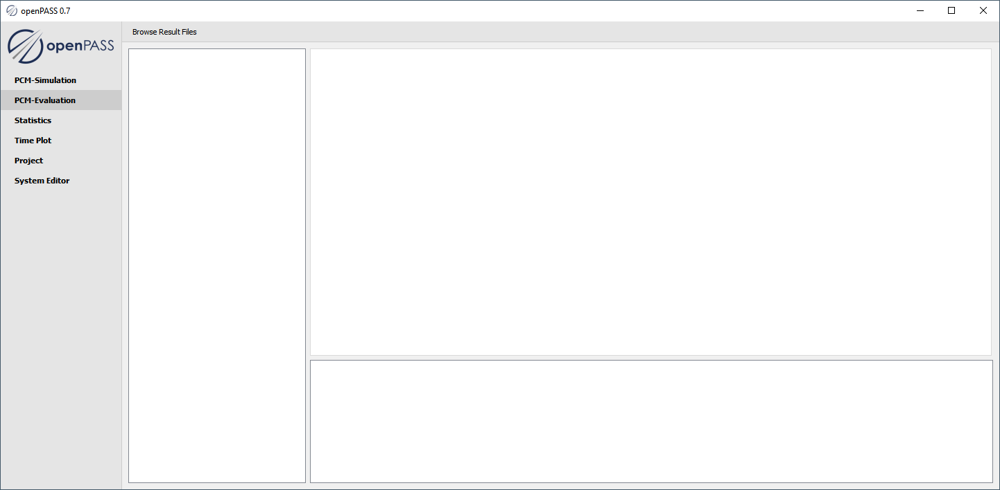
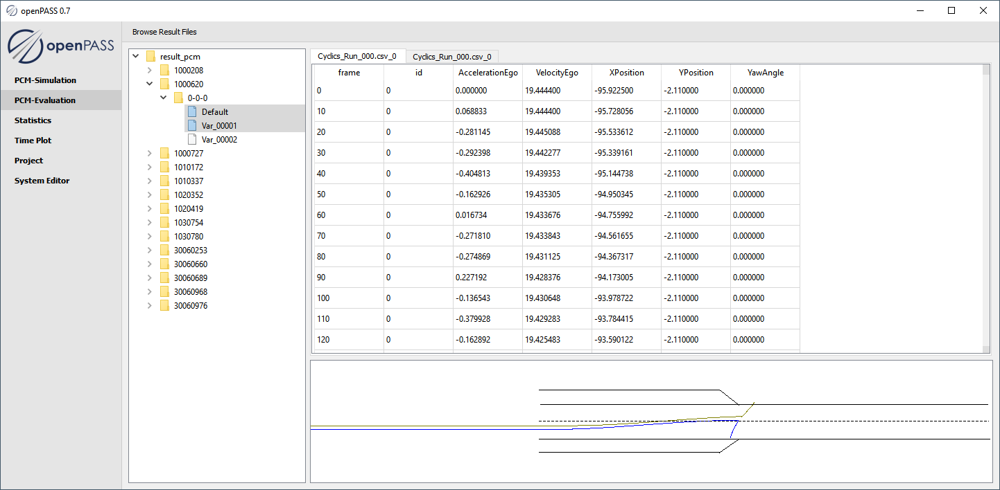

..
  ************************************************************
  Copyright (c) 2021 ITK-Engineering GmbH

  This program and the accompanying materials are made
  available under the terms of the Eclipse Public License 2.0
  which is available at https://www.eclipse.org/legal/epl-2.0/

  SPDX-License-Identifier: EPL-2.0
  ************************************************************

.. _pcm_eval:

PCM_Eval
========

This plugin is used to load results of previous simulations. 

Loading results
---------------

* Click ``Browse Result Files`` to choose a result folder to be evaluated.
* Simulation results are displayed in a tree structure

.. note::

  Result folder has to be structured like the result folder of a previous simulation.
  See :ref:`result_folder_structure`

Evaluating results
------------------

* Select result files to be shown. 

.. note::
  It is possible to select multiple files compare the trajectories in the visualization area.

