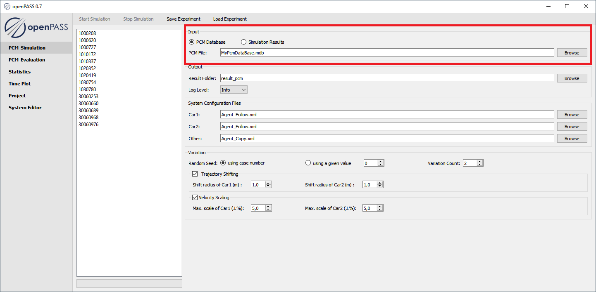
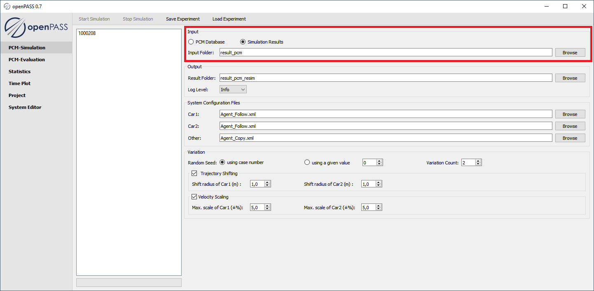
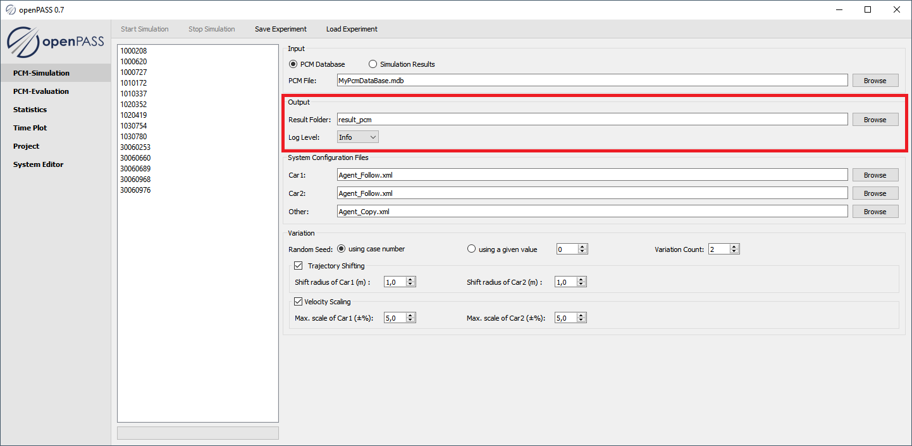
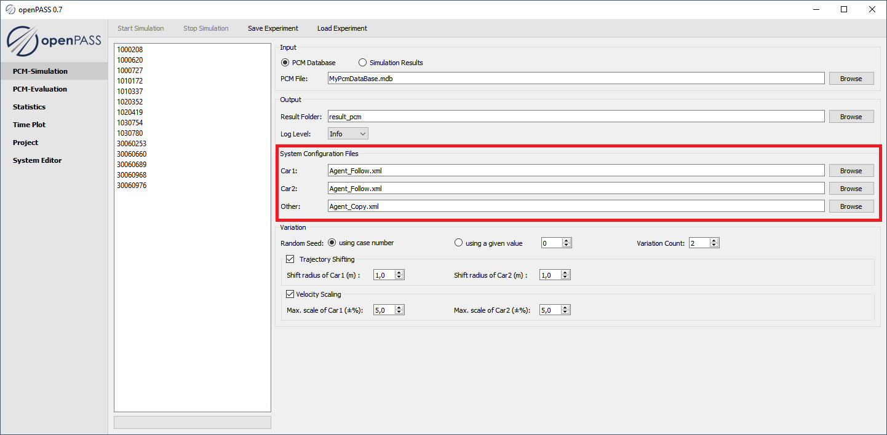
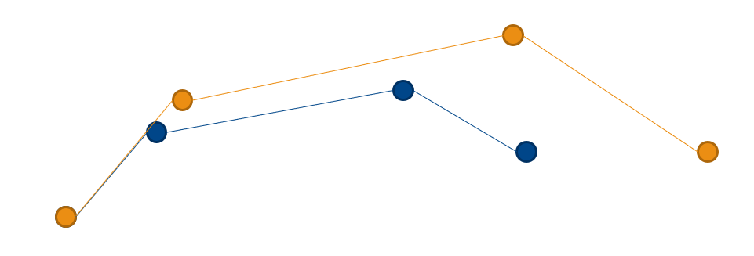
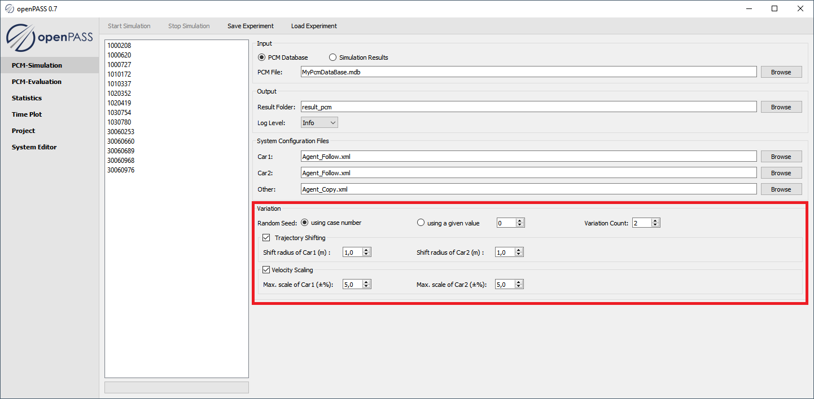
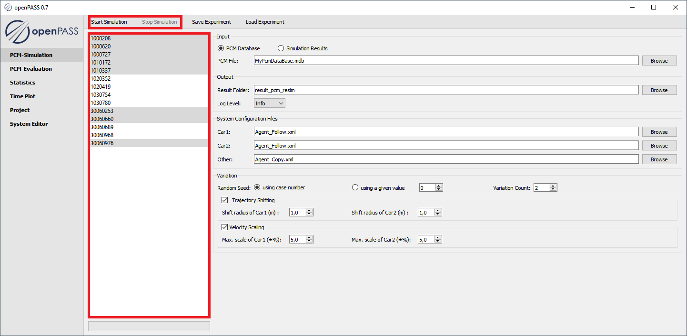
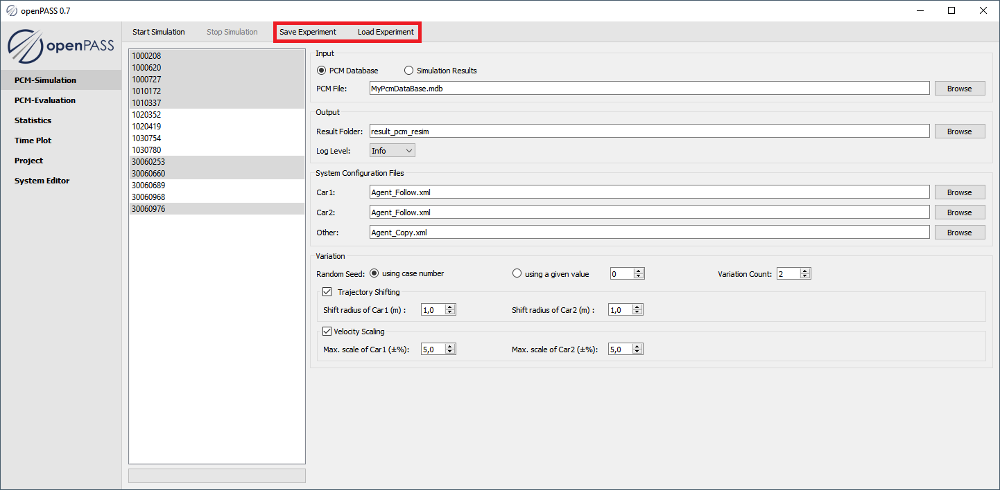

..
  ************************************************************
  Copyright (c) 2021 ITK-Engineering GmbH

  This program and the accompanying materials are made
  available under the terms of the Eclipse Public License 2.0
  which is available at https://www.eclipse.org/legal/epl-2.0/

  SPDX-License-Identifier: EPL-2.0
  ************************************************************

.. _pcm_sim:

PCM Simulation
==============

This plugin is used to configure and start a simulation based pcm data or simulation configuration sets of previous simulations.

Simulation Input
----------------

* **UseCase: Database**

   * Select the radio button ``PCM Database``
   * Select a PCM database file

* **UseCase: Resimulation**

   * Select the radio button ``Simulation Results``
   * Select a folder with previous Results

   .. note::

      The selected output folder must be different to the input folder

   .. warning::

      To ensure that the previous results are correctly read, the folder structure of the results has to follow the structure the GUI itself generates when the simulation is started from a database. 
      Only the configuration files of the default folders are loaded. No variation is loaded and taken into account at this place.

Simulation Output
-----------------

   * In ``Result Folder`` you can select a folder where the output shall be written
   * In ``Log Level`` you can define at what level a logging output shall be produced 

      * ``Error``     - Log only Errors
      * ``Warning``   - Log additionally warnings
      * ``Info``      - Log additionally information
      * ``Debug``     - Log additionally debug information

Simulation Configuration
------------------------

At this point, the User is able to choose what system configuration shall be used for each agent.
The User can either select one or multiple system configuration files (comma separated). 
In the case of multiple files are configured, there will be unique sets of simulation configuration files generated for each possible combination, which are placed in folders named / coded like ``<Car1_Index>-<Car2_Index>-<Other_Index>`` e.g. ``1-0-2`` 

Variation
---------

* The random seed can be set to a specific initial random seed by ``using a given value`` or just by ``using the case number``
* The number runs can with different random seed can be set by changing ``Variation Count`` 
* The original trajectory can be shifted randomly by setting the ``Shift radius`` for *Car1* and *Car2*

   * Given a shift radius R for a vehicle
   * For each position P in trajectory, it shifted position P’ is calculated by randomly generating a distance D (D<= R) and a relative angle in polar coordinate 

   .. math::
      `x_{\text{new}}(t) = x(t) + \delta x`
      `y_{\text{new}}(t) = x(y) + \delta y`
  
.. image:: _static/images/plugin/pcm_sim/trajectory_shifting.png

* The original velocity can be scaled randomly by setting the ``Max scale`` for *Car1* and *Car2*
* Given a velocity deviation :math `\delta V` for a vehicle
* In a trajectory, a position P_{i} is represented as

   .. math::
      `x(t) = x_{0} + \int_{0}^{t} v_{x} (t) dt` 
      `y(t) = y_{0} + \int_{0}^{t} v_{y} (t) dt` 

* The new position P_{i} can be represented as

  .. math::
      `x(t) = x_{0} + k \int_{0}^{t} v_{x} (t) dt` 
      `y(t) = y_{0} + k \int_{0}^{t} v_{y} (t) dt` 
   
* with a scaling factor k

.. note::

   The additional random seeds which are used by the variation are chosen randomly depending on the initial random seed.
   Therefore they´re reproducible

Simulation Start
----------------

* Select one or multiple simulation cases (by pressing the CTRL / SHIFT key)

* Press the button ``Start Simulation``

.. note::

   The User can interrupt the simulation process by pressing ``Stop Simulation``. 
   The simulation will stop after the current simulation is finished.
   Therefore it won´t start the remaining simulations anymore.

Save / Load Experiment
----------------------

Every change in the gui can be saved as in "Experiment" in an text file. 
This file can later be loaded to retrieve the previous used configuration of the "Experiment".

.. _result_folder_structure:

Result Folder Structure
-----------------------

* <Result Folder Name> (e.g. *result_pcm*)

   * <Case Name> (e.g. *1000208*)

      * <System Configuration combination code> (e.g. *1-0-2*)

         * <Variation Name> (e.g. *default* or *Var_00001*)
  