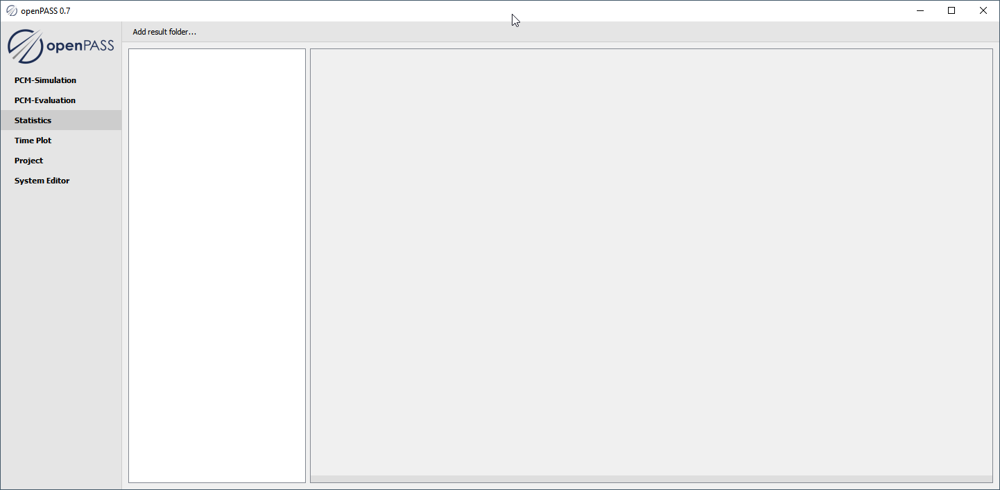
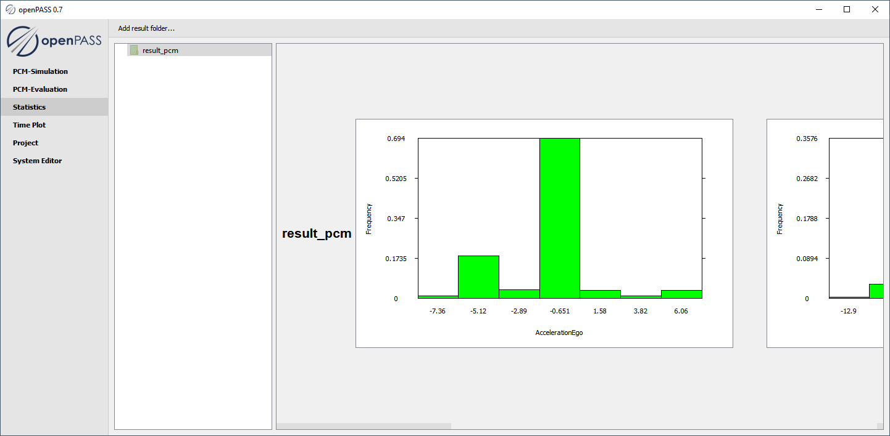

..
  ************************************************************
  Copyright (c) 2021 ITK-Engineering GmbH

  This program and the accompanying materials are made
  available under the terms of the Eclipse Public License 2.0
  which is available at https://www.eclipse.org/legal/epl-2.0/

  SPDX-License-Identifier: EPL-2.0
  ************************************************************

.. _statistics:

Statistics
==========

This plugin is used to calculate and show statistics and histograms from a result folder.

Loading Results
---------------

* Click ``Add result folder`` to choose a result folder of which the statistics shall be calculated.

.. note::

   It is possible to add multiple result folders.

      * Subsequently selected folders are added to the list in the TreeView
      * Histograms will be calculated for each folder including subfolders and will be shown in a new row



Evaluating Results
------------------

* Select a result folder for showing their statistics and histogramms
* Histograms over a folder are shown in one (scrollable) row of images
* Selecting the white background of the folder list clears the histogram preview panel
* Each row of histograms contains the contents of the corresponding folder in the folder list
* Adding a new folder re-calculates all histograms for each column using a common x-range

.. note::

   Select an input folder that contains files in the following format

      * Relevant files need ending ``.csv```
      * Columns can be separated by comma, semicolon or space
      * First two columns need *frame* and *id** in header

.. warning::

   For all files in a selected folder and subfolders the headers are read in

      * All of these files consistent with the first read header are used to calculate histograms for all columns
      * Files with non-consistent headers are ignored


