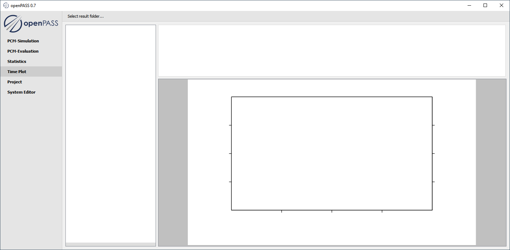
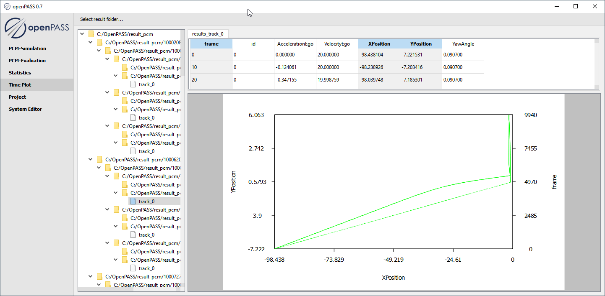

..
  ************************************************************
  Copyright (c) 2021 ITK-Engineering GmbH

  This program and the accompanying materials are made
  available under the terms of the Eclipse Public License 2.0
  which is available at https://www.eclipse.org/legal/epl-2.0/

  SPDX-License-Identifier: EPL-2.0
  ************************************************************

.. _timeplot:

TimePlot
========

This plugin is used to plot trajectories (position, velocity, etc.) over time.

Loading results
---------------

* Click ``Select result folder`` to choose a result folder that contains files in the required format (see below) to be plotted.

Evaluating results
------------------

* Select an input folder that contains files in this format:

  * Relevant files need ending ``.csv``
  * Columns can be separated by comma, semicolon or space
  * First two columns need *frame* and *id** in header

* Select table column to be plotted (up to three)
* For each open tab the selected columns are plotted 

  * first column selected is shown on the x-axis
  * second column selected is shown on the y-axis
  * third column selected is shown on the right y-axis

.. note::
  * The track_id items can be selected individually
  * Selecting the lowest subfolders yields tabs for all contained tracks
  * Selections can be combined with ``Ctrl+select`` or ``Shift+select``

