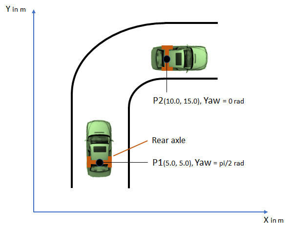
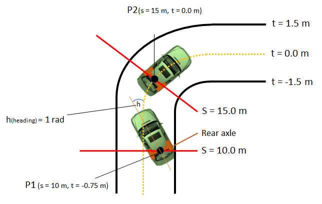
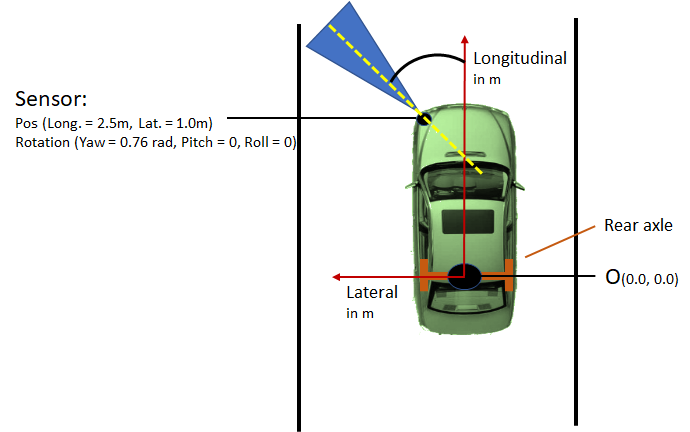
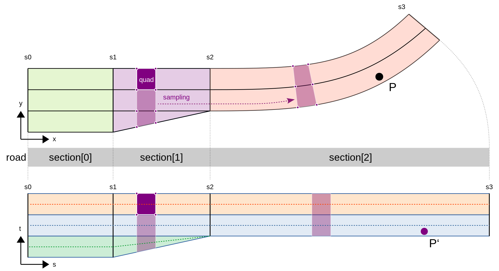
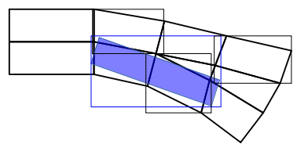
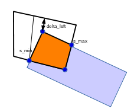
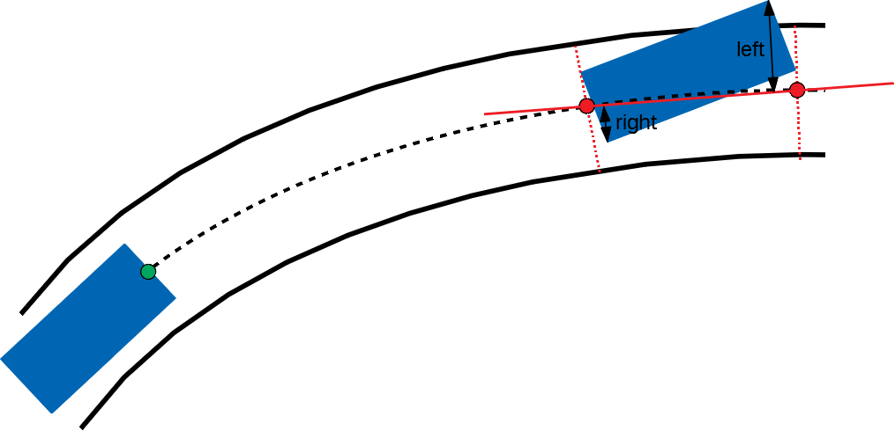

..
  *******************************************************************************
  Copyright (c) 2021 in-tech GmbH

  This program and the accompanying materials are made available under the
  terms of the Eclipse Public License 2.0 which is available at
  http://www.eclipse.org/legal/epl-2.0.

  SPDX-License-Identifier: EPL-2.0
  *******************************************************************************

.. _world_osi:

World_OSI
==========

.. _world_coordinatesystems:

Coordinate Systems
------------------

OpenPass uses 3 different coordinate systems.
All systems rotate counterclockwise and use radian.

World Coordinate System
~~~~~~~~~~~~~~~~~~~~~~~

The world coordinate system is absolute. It is the parent coordinate system and all other systems are relative to the world coordinate system.
This system consists of *x*, *y* and *z* (*z* is currently unused).

   World Coordinate System

Road Coordinate System
~~~~~~~~~~~~~~~~~~~~~~

The road coordinate system is relative to the position of the road in the world coordinate system. 
It consists of *s* and *t* coordinates, where *s* describes the longitudinal position along the road. 
At the beginning of the road *s* = 0, increasing with the downstream direction of the road.
The coordinate *t* describes the lateral position relative to the center of the road, where *t* > 0 indicates left side and *t < 0* right side of the road with respect to the road direction. 

   Road Coordinate System

Agent Coordinate System
~~~~~~~~~~~~~~~~~~~~~~~

The agent coordinate system is relative to the position of the agent in the world coordinate system. 
It uses longitudinal, lateral and height (height currently unused).
The system originates at the *reference point*, which is located at the center of the rear axle. 
The longitudinal axis is parallel to the length of the car and the lateral axis is parallel to the width of the car.

   Agent Coordinate System
   
.. _world_sampling:

Sampling of World Geometries
----------------------------

.. _OpenDRIVE: https://www.asam.net/standards/detail/opendrive/
.. _open simulation interface: https://github.com/OpenSimulationInterface
.. _Ramer-Douglas-Peucker algorithm: https://en.wikipedia.org/wiki/Ramer%E2%80%93Douglas%E2%80%93Peucker_algorithm

Roads are described following the `OpenDRIVE`_ specification.
There the geometry of a road is defined algebraically as lines, clothoids and by means of cubic polynomials, whereby primarily only one reference line is defined.
The lanes can be understood as a stack of parallel lanes, which are given by the width and the offset, now in relation to this reference line, which acts as the underlying coordinate system ('s/t' road coordinates with s along the road).
Here, too, width and offset are defined algebraically, which means that almost any boundary lines can be defined.

When the world is initialized, these boundary definitions (i.e. algebraic geometries) are converted into piecewise linear elements, which is called sampling.
The road is scanned at a constant interval along 's', which leads to four-sided (quadrangular) sections of the lanes at common 's' coordinates, so-called lane elements (see LaneElement).
The scanning is carried out at a scanning rate of 10 centimeters with the aim of achieving a total scanning error of less than 5 centimeters, as required by the representation used internally (c.f. `open simulation interface`_).
Note that this error is only guaranteed if geometries do not exhibit extreme curvatures, i.e. a deviation of more than 5 cm within two sampling points (10 cm along s).
The scanned points define so-called joints, which contain all scanned points at an 's' coordinate across all lane boundaries of the given road.
The number of these joints is reduced by a `Ramer-Douglas-Peucker algorithm`_, which ensures that the maximum lateral error of each individual point within a joint is less than 5 cm compared to the originally scanned points.
Note that (a) the boundary points of geometries are always retained and (b) additional points for lane marking transitions are also retained to ensure the maximum accuracy of these edge cases.
The lane elements are generated with two successive connections, which are ultimately used in the localization at runtime (see :ref:`world_localization`).

Internally, each lane element receives a constant direction, which is defined by the direction of the vector spanned between the centers of the corresponding connections.
Each joint also holds the corresponding curvature of the road, so that the curvature can be interpolated linearly within a lane element along the 's' coordinate.

.. _world_localization:

Localization
------------

Generally, the position of an agent is stored with respect to [world coordinates (x,y)](\ref dev_concepts_coordinatesystems_world).
As queries on the world operates in [road coordinates (s,t)](\ref dev_concepts_coordinatesystems_road), the position of the agent needs to be transformed.

This section describes the translation of coordinates (x,y) of an agent into RoadCoordinate (s,t), whereas the notion of (s,t) comes from the `OpenDRIVE`_ standard.  

Basics
~~~~~~

The following image depics the basic principes of the localization which is rooted on the specifics of the OSI World Layer (aka OWL).

   Localization Basics

Given is a point P in cartesian coordinates (x/y). 
The task is to assign the point to a lane, defined by a general road geometry and calculate the transformed Point P' in road coordinates (s/t).

Road geometry (based on OpenDRIVE):

 - A road consists of several sections
 - Each section consists of several lanes
 - Within a section, the number of lanes is constant
 - Lanes can have one predecessor and one successor
 - The road follows a reference line, which is the reference for the *s*\ -coordinate.
   The *t*\ -coordinate is perpendicular to this line.

OWL specifics:

 - All lanes are sampled, generating a stream of generic quadrilaterals (LaneGeometryElements).
 - Within a section, the number of quads per lane is equal, and all lanes have the same length in s.
 - This is realized by a variable sampling width, determined by a constant sampling width along the longest arc.
 - Consequently, points perpendicular to the reference line (*t*\ -axis) have the same *s*\ -coordinate.

Note, that the final *t*\ -coorindate is calculated with respect to a virtual reference line for each lane.
This means, that points on the center of a lane have *t*\ -coordinate of 0.

Localization sequence
~~~~~~~~~~~~~~~~~~~~~

.. _r-tree: https://www.boost.org/doc/libs/1_65_0/libs/geometry/doc/html/geometry/reference/spatial_indexes/boost__geometry__index__rtree.html

An `r-tree`_ is used to store each LaneGeometryElement.
Thereby, due to the nature of the r-tree, the bounding box of the LaneGeometryElement is described by its maximum Cartesian coordinates (x_min, x_max, y_min, y_max).
Objects are located by retrieving all intersecting bounding boxes from the r-tree.
The picture below shows an example of an agent (blue) with the corresponding Cartesian bounding box, and all located LaneGeometryElements.

   Example of bounding boxes of LaneGeometryElements and agent

As the true boundary polygon may be smaller, the actual intersection polygon of the object and each LaneGeometryElement is calculated. 
For each point of a non-empty intersection polygon, the s and t coordinates are calculated and aggregated with respect to the underlying lane.
For each touched lane, the minimum and maximum s coordinate, and the minimum and maximum lane remainder (delta t) is stored.

   Example for the calculation of s_min, s_max and delta_left

In addition, if the reference point (i.e. the middle of the rear axle) or the mainLaneLocator (i.e. the middle of the agent front) are located within a LaneGeometryElement, s/t/yaw is calculated of each point, respectively.
Further aggregation is done with respect to each road by calculating the minimum and maximum s for each road the agent intersects with. 
For the current route of an agent, the following information is stored: s/t/yaw of the reference point and mainLaneLocator on the route (roads along a route are not allowed to intersect), distance from the lane boundary to the left and right for the road(s) along the route, and OpenDRIVE Ids of the lanes on the route that the agent touches. 
The results also holds information wether both the reference point and the mainLaneLocator lay on the route.
In the currently implementation, these points must be located - otherwise the agent is despawened, as the agent cannot execute distance queries without a relation to its current route.

.. _world_trafficsigns:

Traffic Signs, Road Markings and TrafficLights
----------------------------------------------

The world currently supports a variety of traffic signs, road markings and traffic lights.
All of these are defined in OpenDRIVE as "RoadSignal".
At the moment it can only interpret traffic signs and road markings according to the German regulations "StVo" and traffic lights according the the OpenDRIVE appendix.
Traffic signs can contain optional supplementary traffic signs. Supplementary signs are dependent on a main traffic sign and contain additional information.
The following traffic signs are supported:

.. table::
   :class: tight-table
   
   ============================================= ========= =========== =================================================================================
   TrafficSign                                   StVo Type Subtype     Value and Units   
   ============================================= ========= =========== =================================================================================
   GiveWay                                       205             
   Stop                                          206       
   DoNotEnter                                    267
   EnvironmentalZoneBegin                        270.1       
   EnvironmentalZoneEnd                          270.2
   MaximumSpeedLimit                             274       X           The subtype "X" is used to define the speedlimit in km/h.
                                                                       Afterwards the world converts it to m/s. 
   SpeedLimitZoneBegin                           274.1     -/20        The subtype is used to define the speedlimit in km/h.
                                                                       Afterwards the world converts it to m/s.
                                                                       No subtype = 30km/h, 20 = 20km/h 
   SpeedLimitZoneEnd                             274.2     -/20        The subtype is used to define the speedlimit in km/h.
                                                                       Afterwards the world converts it to m/s.
                                                                       No subtype = 30km/h, 20 = 20km/h 
   MinimumSpeedLimit                             275       X           The subtype is used to define the speedlimit in km/h.
                                                                       Afterwards the world converts it to m/s. 
   OvertakingBanBegin                            276
   OvertakingBanTrucksBegin                      277
   EndOfMaximumSpeedLimit                        278       X           The subtype "X" is used to define the speedlimit in km/h.
                                                                       Afterwards the world converts it to m/s. 
   EndOfMinimumSpeedLimit                        279       X           The subtype "X" is used to define the speedlimit in km/h.
                                                                       Afterwards the world converts it to m/s. 
   OvertakingBanEnd                              280
   OvertakingBanTrucksEnd                        281
   EndOffAllSpeedLimitsAndOvertakingRestrictions 282
   RightOfWayNextIntersection                    301
   RightOfWayBegin                               306
   RightOfWayEnd                                 307
   TownBegin                                     310                   This sign contains a text describing the name of the town 
   TownEnd                                       311                   This sign contains a text describing the name of the town 
   TrafficCalmedDistrictBegin                    325.1
   TrafficCalmedDistrictEnd                      325.2
   HighWayBegin                                  330.1
   HighWayEnd                                    330.2
   HighWayExit                                   333
   AnnounceHighwayExit                           448
   HighwayExitPole                               450       50/51/52    The subtype describes the distance to the highway exit in m.
                                                                       50 = 100m, 51 = 200m, 52 = 300m 
   AnnounceRightLaneEnd                          531       10/11/12/13 The subtype describes the number of continuing lanes after the right lane ends.
                                                                       10 = 1 lane, 11 = 2 lanes, 12 = 3 lanes, 13 = 4 lanes 
   AnnounceLeftLaneEnd                           531       20/21/22/23 The subtype describes the number of continuing lanes after the left lane ends.
                                                                       10 = 1 lane, 11 = 2 lanes, 12 = 3 lanes, 13 = 4 lanes 
   DistanceIndication                            1004      30/31/32    For subtype 30 the value describes the distance in m.
                                                                       For subtype 31 the value describes the distance in km.
                                                                       Subtype 32 has a STOP in 100m.
   ============================================= ========= =========== =================================================================================

The following road markings are supported:

.. table::
   :class: tight-table
   
   ======================= ========= =======     ================
   RoadMarking             StVo Type Subtype     Value and Units
   ======================= ========= =======     ================
   PedestrianCrossing      293     
   Stop line               294
   ======================= ========= =======     ================

The pedestrian crossing can also be defined in OpenDRIVE as object with type "crosswalk".

The following traffic lights are supported:

.. table::
   :class: tight-table
   
   ============================================= =============== ======= ===============
   TrafficLight                                  OpenDRIVE Type  Subtype Value and Units
   ============================================= =============== ======= ===============
   Standard traffic light (red, yellow, green)   1.000.001       -       -              
   Left arrows                                   1.000.011       10      -              
   Right arrows                                  1.000.011       20      -              
   Upwards arrows                                1.000.011       30      -              
   Left und upwards arrows                       1.000.011       40      -              
   Right und upwards arrows                      1.000.011       50      -               
   ============================================= =============== ======= ===============

These traffic lights are controlled by OpenScenario.

.. _world_lanemarkings:

Lane Markings
-------------

The world also supports lane markings (i.e. printed lines between two lanes) according to the OpenDRIVE standard.
The following attributes of the "roadMark" tag in the scenery file are stored in the world and can be retrieved by the GetLaneMarkings query: sOffset, type, weight, color.
The weight is converted into a width in meter: 0.15 for standard and 0.3 for bold. Lane markings are also converted to OSI LaneBoundaries.
For the OpenDRIVE type "solid solid", "solid broken", "broken solid", and "broken broken" two LaneBoundaries are created in OSI with a fixed lateral distance of 0.15m.

.. _world_getobstruction:

GetObstruction
--------------

The GetObstruction function calculates the lateral distance an agent must travel in order to align with either the left or right boundary of a target object occupying the same lane.

The calculation adheres to the following process:

#) Project the agent's MainLaneLocator along the lane to the nearest and furthest s-coordinate of the target object, capturing the projected points
#) Create a straight line from the two captured points
#) Calculate the Euclidean distance of each of the target object's corners to the created line
#) Return the left-most and right-most points with respect to the created line

   Example for the calculation of GetObstruction
