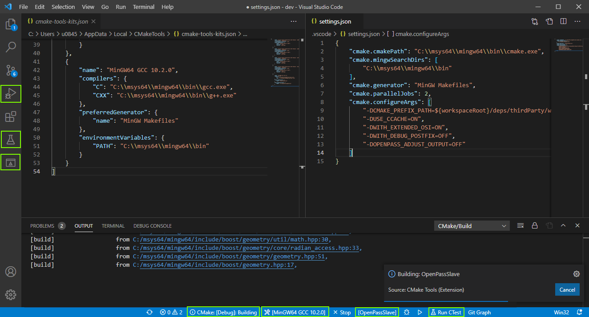

..
  ************************************************************
  Copyright (c) 2021 in-tech GmbH

  This program and the accompanying materials are made
  available under the terms of the Eclipse Public License 2.0
  which is available at https://www.eclipse.org/legal/epl-2.0/

  SPDX-License-Identifier: EPL-2.0
  ************************************************************

Working with VSCode
===================

This section describes the basic setup for Visual Studio Code.
Use it as a template for starting.

   
   Proper setup VSCode showing **left**, debugging, testmate, and cmake pane selectors, and at the **bottom**, build type, kit, current target, and CTest runner.

Assumptions
-----------

- For Windows, it is expected, that a **MSYS2/MinGW 64 Bit** is used.
- For brevity, non-standard libraries are expected to be in the folder ``deps/thirdParty``. 

Install and Config
------------------

#. Install Visual Studio Code

#. Install extensions
   
   - C/C++ 
   - CMake Tools
   - C++ Testmate

#. Open the repository as folder, e.g. by calling ``code simopenpass`` after checking out.
   If CMakeTools are setup right, it should as, if you like to configure it now and always on opening.
   Say yes to configuration, which will create a ``build`` folder, but fails to do more (config follows below).

#. **Windows only** Make Kit available:
   
   #. ``Ctrk+Shift+P``: ``CMake: Edit User-Local CMake Kits``
   #. Insert/Update:

      .. code-block:: JSON
   
         {
           "name": "MinGW64 GCC",
           "compilers": {
               "C": "C:\\msys64\\mingw64\\bin\\gcc.exe",
               "CXX": "C:\\msys64\\mingw64\\bin\\g++.exe"
           },
           "preferredGenerator": {
               "name": "MinGW Makefiles"
           },
           "environmentVariables": {
               "PATH": "C:\\msys64\\mingw64\\bin"
           }
         } 

   +. ``Ctrk+Shift+P``: ``CMake: Select a Kit`` = ``MinGW64 GCC``

#. Configure:

   #. ``Ctrk+Shift+P``: ``Preferences Open Workspace Settings (JSON)``

   #. Insert/Update:

      .. tabs::
   
         .. tab:: Windows
   
            .. code-block:: JSON
   
               {
                   "cmake.cmakePath": "C:\\msys64\\mingw64\\bin\\cmake.exe",
                   "cmake.mingwSearchDirs": [
                       "C:\\msys64\\mingw64\\bin"
                   ],
                   "cmake.generator": "MinGW Makefiles",
                   "cmake.parallelJobs": 2,
                   "cmake.configureArgs": [
                       "-DCMAKE_PREFIX_PATH=${workspaceRoot}/deps/thirdParty/win64/FMILibrary;${workspaceRoot}/deps/thirdParty/win64/osi",
                       "-DUSE_CCACHE=ON",
                       "-DWITH_EXTENDED_OSI=ON",
                       "-DWITH_DEBUG_POSTFIX=OFF",
                       "-DOPENPASS_ADJUST_OUTPUT=OFF"
                   ]
               }
   
         .. tab:: Linux
   
            .. code-block:: JSON
         
               {
                   "cmake.parallelJobs": 2,
                   "cmake.configureArgs": [
                       "-DCMAKE_PREFIX_PATH=${workspaceRoot}/deps/thirdParty/linux64/FMILibrary;${workspaceRoot}/deps/thirdParty/linux64/osi",
                       "-DUSE_CCACHE=ON",
                       "-DCMAKE_INSTALL_PREFIX=/OpenPASS/bin"
                   ]
               }
   
   #. ``Ctrk+Shift+P``: ``CMake: Configure`` - cmake should now be able to configure the project.
      If not, cmake should give you at least a hint, what's missing (normally external libraries).
      Read :ref:`cmake` or :ref:`prerequisites` for more information.
 
      .. note::
      
         When changing libraries, it's recommended to wipe the cmake cache before reconfiguration:
         ``Ctrk+Shift+P`` > ``CMake: Delete Cache and Reconfigure``

Testing
-------

Testmate discovers tests only after they are built for the first time.
It pays to run ``ctest`` on the console to build all test targets.
After this, you should see all tests in the testing pane on the left.
If not, check the extension setting ``testMate.cpp.test.executables`` and ``testMate.cpp.test.workingDirectory``

Debugging
---------

Cmake offers its own debugging functionality, but does not respect the dependencies between the |op| core and its components.
This means, it tries to run the executable from within the build folder, e.g. ``./build/sim/src/core/slave/OpenPassSlave``.
Unfortunately, in here, the core does not find any libraries or configurations.

As a solution, setup a debug target, pointing at the installed executable instead:

#. Got to "Run and Debug" (``Ctrl+Shift+D``) and *create a launch.json file*.

#. Insert/Update:

.. tabs::

   .. tab:: Windows

      .. code-block:: JSON

         {
             "configurations": [
             {
                 "name": "Debug OpenPass",
                 "type": "cppdbg",
                 "request": "launch",
                 "program": "C:/OpenPASS/bin/core/OpenPassSlave.exe",
                 "args": [],
                 "stopAtEntry": false,
                 "cwd": "c:/openpass/bin/core",
                 "environment": [],
                 "externalConsole": false,
                 "MIMode": "gdb",
                 "miDebuggerPath": "C:/msys64/mingw64/bin/gdb.exe",
                 "setupCommands": [
                     {
                         "description": "Enable pretty-printing for gdb",
                         "text": "-enable-pretty-printing",
                         "ignoreFailures": true
                     }
                 ]
             }
         }

   .. tab:: Linux

      .. code-block:: JSON

         {
             "configurations": [
             {
                 "name": "Debug OpenPass",
                 "type": "cppdbg",
                 "request": "launch",
                 "program": "/openPASS/bin/core/OpenPassSlave",
                 "args": [],
                 "stopAtEntry": false,
                 "cwd": "/openPASS/bin/core/",
                 "environment": [],
                 "externalConsole": false,
                 "MIMode": "gdb",
                 "setupCommands": [
                     {
                         "description": "Enable pretty-printing for gdb",
                         "text": "-enable-pretty-printing",
                         "ignoreFailures": true
                     }
                 ]
             }
         }

.. warning:: Don't forget to run the target ``install`` before debugging.