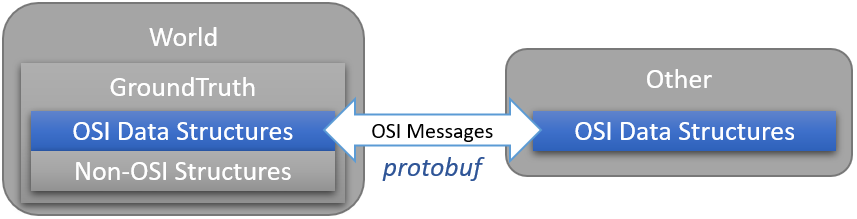

..
  *******************************************************************************
  Copyright (c) 2021 in-tech GmbH

  This program and the accompanying materials are made available under the
  terms of the Eclipse Public License 2.0 which is available at
  http://www.eclipse.org/legal/epl-2.0.

  SPDX-License-Identifier: EPL-2.0
  *******************************************************************************

.. _prerequisites:

Prerequisites
=============

This section gives detailed information about the prerequisite and tested version.
In short:

.. tabs::
   
   .. tab:: Windows (MSYS2)

      .. literalinclude:: _static/msys2_packages.txt
         :language: bash

      Details: :ref:`building_under_windows`

   .. tab:: Linux (Debian Bullseye)

      .. code-block:: bash

         apt install ccache
         apt install cmake
         apt install doxygen
         apt install googletest
         apt install gcc
         apt install g++
         apt install graphviz
         apt install libprotobuf-dev
         apt install protobuf-compiler  # when building osi
         apt install qt5-default

      Details: :ref:`building_under_linux`

GNU Compiler Collection (gcc)
-----------------------------

**Version (latest tested):** 10.2.3

|Op| is developed on Linux and Windows (64-Bit) in `C++17 <https://isocpp.org/>`_ using the GNU Compiler Collection (`gcc <https://gcc.gnu.org/>`_).

.. admonition:: Useful hints

   - | |op| has been developed using gcc 7.x, 8.x, 9.x, and more recently gcc 10.x.
     | There are no known issues regarding the different versions.
   - Since no compiler specific features are used, the source should also compile with `clang <https://clang.llvm.org/>`_.
   - Generally, there is support for `MSVC <https://docs.microsoft.com/en-us/cpp/build/reference/c-cpp-building-reference>`_ , but currently not actively maintained by the |opwg|.

GNU Debugger (gdb)
------------------

**Version (latest tested):** 9.2

Debugging tools for gcc: https://www.gnu.org/savannah-checkouts/gnu/gdb/index.html

CMake
-----

**Version (latest tested):** 3.18.4

|Op| uses `CMake <https://cmake.org/>`_ for building and testing.
For details on the provided options, see :ref:`cmake`.

.. Note:: The former support for ``qmake`` is expiring and not documented anymore.

.. _prerequisites_ccache:

Ccache
------

**Version (latest tested):** 3.7.11

|Op| supports the compiler cache `Ccache <https://ccache.dev/>`_ for faster recompilation.
Use only, if you need to recompile regularly.

.. admonition:: Useful hints
  
   - The first compilation is definilty slower (e.g. by 30%), as the cache needs to be built.
   - If used regularily, increasing the cache size is recommended, e.g.: ``ccache -M 20G``

Doxygen
-------

**Version (latest tested):** 1.8.20

Documentation is created using `Doxygen <https://www.doxygen.nl/index.html>`_.

.. admonition:: Useful hints

   - Doxygen introduced support for Markdown with 1.8, which is still in use.
     Don't use older versions.

Qt Framework
------------

**Version (officially supported):** 5.12.3

|Op| uses some features from the `Qt <https://www.qt.io/>`_ framework.
While the GUI of |op_oss| heavily relies on it, the simulation core tries to stick to the C++ standard framework as far as possible.

.. admonition:: Note on Versions

   | Versions starting from 5.4 should generally work, but are not officially supported anymore/yet.
   | Version 5.15.1 has been reported to work well.

Boost C++ Libraries
-------------------

**Version (officially supported):** 1.72.0

Especially for geometrical calculations, |op| uses parts of the `Boost C++ Libraries <https://www.boost.org/>`_.

.. admonition:: Note on Versions

   More recent versions should integrate without issues, but 1.74.0 already raise warnings for some deprecated headers.

googletest
----------

**Version (officially supported)** 1.10.0

Tests are written in `googletest <https://github.com/google/googletest>`_ and |Op| makes use of the included *googletest* (gtest) C++ testing framework, as well as the included mocking framework *googlemock* (gmock).

.. note::

   The lastest major release brought several API changes, which made some code fixes necessary. 
   Use newer versions with precaution.

.. _prerequisites_osi:

Open Simulation Interface (OSI)
-------------------------------

**Version (officially supported):** 3.2.0

The internal world representation uses the `Open Simulation Interface <https://github.com/OpenSimulationInterface>`_ (:term:`OSI`) as part of its ground truth (backend storage) and exchange format.

   Interaction between World and consumers of OSI messages.

Thereby, OSI provides data structures for representation of various objects in traffic simulation environments.
Note that OSI is primarily developed in a sensor centric view, such as lane markings and object boundaries.
Beyond that, |op| holds data for non-sensor centric data, such as metainfo on lanes and roads.

As shown, OSI itself depends on :ref:`prerequisites_protobuf`.
If not already installed, the library and headers have to be built prior to OSI.

.. admonition:: Note on Versions

   |Op| supports **integration of custom made or experimental versions** of OSI (see :ref:`building_osi`).
   For example, `Algorithm_FmuWrapper` and the wrapped `OSMP` FMUs use the proposed OSI messages `TrafficUpdate` and `TrafficCommand`, not yet defined in OSI 3.2.0.

.. _prerequisites_protobuf:

Protocol Buffers (protobuf)
---------------------------

**Supported Version (officially supported):** 3.12.2

:ref:`prerequisites_osi` uses `Protocol Buffers <https://developers.google.com/protocol-buffers>`_ for describing and serialization of its datastructures.

.. admonition:: Note on Versions

   - So far, no version limitations known (including 2.x).
   - |Op| lets you integrate your own protobuf libraries if necessary (see :ref:`building_protobuf`).

Modelon FMI Library (FMIL)
--------------------------

**Supported Version:**  2.0.3

For integration of Functional Mock-up Units (FMUs) the `Algorithm_FmuWrapper` uses the `Modelon FMI Library <https://github.com/modelon-community/fmi-library>`_.
As there is no binary available, FMIL needs to be build from scratch before |op| can be compiled (see :ref:`building_fmil`).