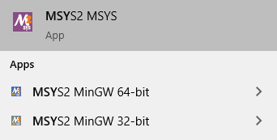

..
  ************************************************************
  Copyright (c) 2021 in-tech GmbH
                2021 BMW AG

  This program and the accompanying materials are made
  available under the terms of the Eclipse Public License 2.0
  which is available at https://www.eclipse.org/legal/epl-2.0/

  SPDX-License-Identifier: EPL-2.0
  ************************************************************

.. _system_requirements:

System Requirements
*******************

The following tools need to be installed in order to set up your system.

.. _building_under_windows:

Building under Windows
======================

To compile |op| with gcc/g++ locally under Windows, :term:`MSYS2` programming tools are recommended.

.. warning::

   | The windows programming tools suffer from a `path length restriction`.
   | This error manifests as strange **file not found** compile errors.

.. admonition:: Recommendation

   | Use a short path for source code checkout, or map it directly to a drive letter.
   | This can be done by the windows command `subst <https://docs.microsoft.com/en-us/windows-server/administration/windows-commands/subst>`_.

.. _msys2:

MSYS2
-----
.. admonition:: Recommendation

   | This is a condensed version of the original MSYS2 guide found `here <https://www.msys2.org/>`_.

Download
^^^^^^^^

- Latest 64-bit packages are located at https://repo.msys2.org/distrib/x86_64/.
- Download a non-base package, i.e. `msys2-x86_64-20200903.exe <https://repo.msys2.org/distrib/x86_64/msys2-x86_64-20200903.exe>`_

.. _msys2_installation:

Installation
^^^^^^^^^^^^

Run the downloaded executable and adjust suggested settings to your needs (defaults are fine).
In the following, it is assumed that MSYS2 is installed under ``C:\msys64``.

Environments
^^^^^^^^^^^^

MSYS2 provides three different environments, located in the MSYS2 installation directory:

.. _fig_msys2_environments:

:align: center
:alt: MSYS2 Apps

MSYS2 Environments

- MSYS2 MSYS: Common environment, i.e. for package management
- MSYS2 MinGW 32-bit: A MinGW 32-bit environment
- MSYS2 MinGW 64-bit: A MinGW 64-bit environment

.. warning::

   | MSYS2 MinGW 64-bi is **the**  |op| development environment and will be referred to as |mingw_shell|.

.. _building_under_linux:

Building under Linux
====================

OpenPass is developed under Debian 64-Bit, which means that developing under a recent Ubuntu distribution should also work.
Debian uses ``apt`` (or ``apt-get``) as package managing system, and most prerequisites should be installable via ``app install package``.
Details will be given in :ref:`prerequisites`.