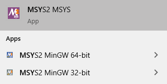

..
  *******************************************************************************
  Copyright (c) 2021 in-tech GmbH

  This program and the accompanying materials are made available under the
  terms of the Eclipse Public License 2.0 which is available at
  http://www.eclipse.org/legal/epl-2.0.

  SPDX-License-Identifier: EPL-2.0
  *******************************************************************************

.. _building_under_windows:

Building under Windows
======================

To compile |op| with gcc/g++ locally under Windows, :term:`MSYS2` programming tools are recommended.

.. warning::
   | The windows programming tools suffer from a `path length restriction`.
   | This error manifests as strange **file not found** compile errors.

.. admonition:: Recommendation

   | Use a short path for source code checkout, or map it directly to a drive letter.
   | This can be done by the windows command `subst <https://docs.microsoft.com/en-us/windows-server/administration/windows-commands/subst>`_.

.. _msys2:

MSYS2
~~~~~

| This is a condensed version of the original MSYS2 guide found `here <https://www.msys2.org/>`_.

Download
--------

- Latest 64-bit packages are located at https://repo.msys2.org/distrib/x86_64/.
- Download a non-base package, i.e. `msys2-x86_64-20200903.exe <https://repo.msys2.org/distrib/x86_64/msys2-x86_64-20200903.exe>`_

.. _msys2_installation:

Installation
------------

Run the downloaded executable and adjust suggested settings to your needs (defaults are fine).
In the following, it is assumed that MSYS2 is installed under ``C:\msys64``.

Environments
-------------

MSYS2 provides three different environments, located in the MSYS2 installation directory:

.. _fig_msys2_environments:

   MSYS2 Environments

- MSYS2 MSYS: Common environment, i.e. for package management
- MSYS2 MinGW 32-bit: A MinGW 32-bit environment
- | MSYS2 MinGW 64-bit: A MinGW 64-bit environment
  | This is **the**  |op| development environment and will be referred to as |mingw_shell|.

.. _msys2_packages:

Packages
--------

Update and install required packages (see also :ref:`prerequisites`).

#. Open ``MSYS2 MSYS`` and execute the following package manager ``pacman`` commands to update the package repository and upgrade system packages:

   .. code-block:: bash

      pacman -Syuu
  
   If the upgrade requires a restart of MSYS2, resume the upgrade by re-opening the shell and call:

   .. code-block:: bash
   
      pacman -Suu

#. Required packages (can be specified in single command line if desired):

   .. literalinclude:: _static/msys2_packages.txt
      :language: bash

   .. admonition:: Versions
      
      | MSYS2 provides rolling release versions, so some packages might be too "up-to-date".
      | Tested packages - ate time of writing - have been listed above as comment.
      | If in doubt, download the package in the right version from the `MSYS2 package repository <http://repo.msys2.org/mingw/x86_64/>`_.
      | Install with ``pacman -U <package-filename>``

#. Optional Packages

   .. code-block:: bash

      pacman -S git
      pacman -S diffutils
      pacman -S patch
      pacman -S dos2unix
      pacman -S mingw-w64-x86_64-ag
      pacman -S mingw-w64-x86_64-qt5-debug

.. admonition:: GIT/SSH
 
   The |mingw_shell| does not access an already existing git installation or available SSH keys.
   Make sure, to update/copy your configuration and credentials within the |mingw_shell| before working with git.   

Building OpenPASS
-----------------

This snippet shows an example for building the |op_oss| simulation core from within the |mingw_shell|.
Refer to :ref:`cmake` for details on the arguments.

.. code-block:: bash

   cmake -G "MinGW Makefiles" \
     -D CMAKE_BUILD_TYPE=Debug \
     -D OPENPASS_ADJUST_OUTPUT=OFF \
     -D USE_CCACHE=ON \
     -D WITH_DEBUG_POSTFIX=OFF \
     -D WITH_GUI=OFF \
     -D WITH_PROTOBUF_ARENA=ON \
     -D CMAKE_INSTALL_PREFIX=C:/OpenPASS/bin/core \
     -D CMAKE_PREFIX_PATH="PATH_FMIL;PATH_BOOST;PATH_OSI;PATH_PROTOBUF;PATH_GTEST" \
     ..
     
     mingw32-make -j3
     mingw32-make install

.. note::
   
   The call to mingw32-make might be misleading, but actually calls gcc/g++ 64-bit.

.. _runmingwexe:

Execution
---------

Files compiled within the |mingw_shell| depend on the :term:`MinGW` libraries.
Providing this libraries to the executable can be done by following means:

- Execute within the |mingw_shell|.
- Add ``C:\msys64\mingw64\bin`` permanently to the *Windows Environment Variable* ``Path``.
- Temporarily set ``Path`` prior to the execution, e.g. in a wrapper:

  .. code-block:: batch
      
     # your_program.cmd
     Path=C:\msys64\mingw64\bin;%Path% # set Path
     your_program.exe                  # execute

- | Copy the required libraries right next to your executable. 
  | For |op|, the following librares are required:

  - libdouble-conversion.dll
  - libgcc_s_seh-1.dll
  - libicudt67.dll
  - libicuin67.dll
  - libicuuc67.dll
  - libpcre2-16-0.dll
  - libstdc++-6.dll
  - libwinpthread-1.dll
  - libzstd.dll
  - zlib1.dll

  .. warning::
  
     You might need to update the some libraries manually, when package are upgraded.
